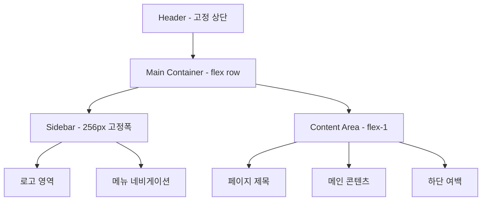
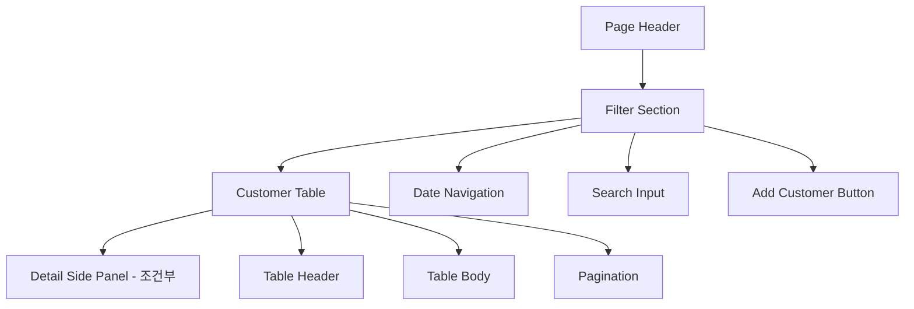
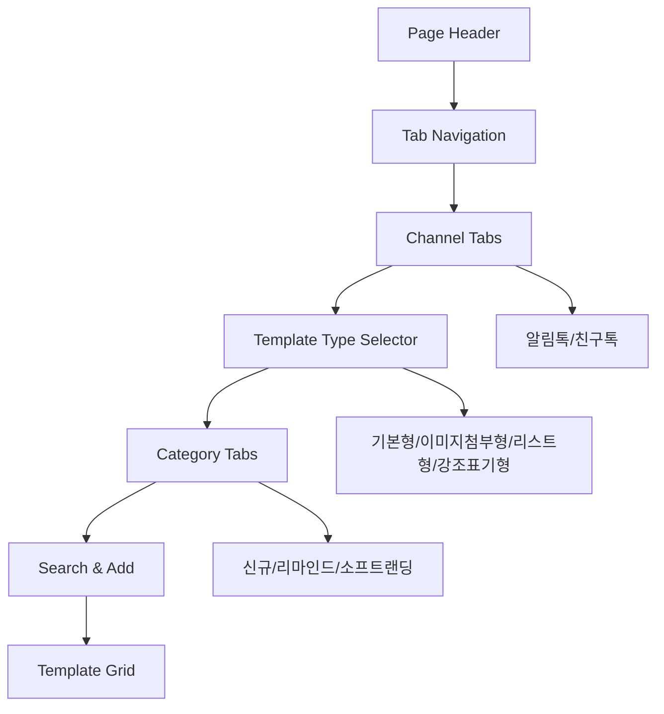
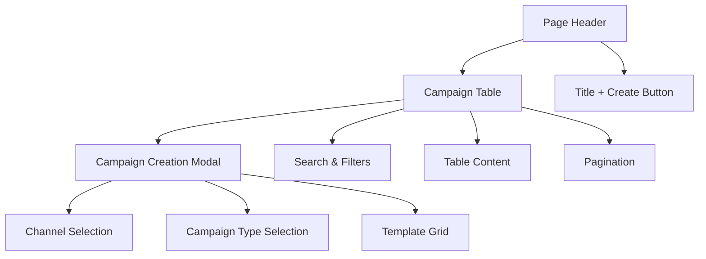
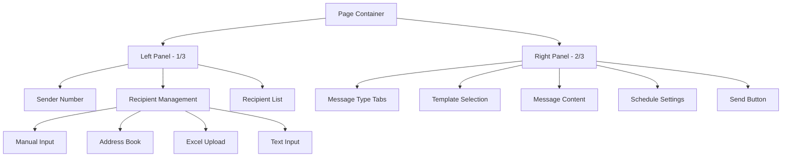

# 🎨 페이지별 와이어프레임 - Fitness CRM

## 📋 목차
- [대시보드 레이아웃](#대시보드-레이아웃)
- [고객 관리 페이지](#고객-관리-페이지)
- [메시지 관리 페이지](#메시지-관리-페이지)
- [캠페인 관리 페이지](#캠페인-관리-페이지)
- [단체 메시지 페이지](#단체-메시지-페이지)
- [상품 관리 페이지](#상품-관리-페이지)
- [통계 페이지](#통계-페이지)
- [설정 페이지](#설정-페이지)

---

## 대시보드 레이아웃

### 전체 레이아웃 구조


### 상세 레이아웃
```
┌─────────────────────────────────────────────────────────────┐
│ Header (고정 h-16, bg-white, shadow)                        │
│ ┌─────────────┐ ┌───────────────┐ ┌─────────┐ ┌─────────┐   │
│ │ Breadcrumb  │ │   Search      │ │ Profile │ │ Logout  │   │
│ └─────────────┘ └───────────────┘ └─────────┘ └─────────┘   │
├─────────────────────────────────────────────────────────────┤
│ ┌─────────────┐ ┌─────────────────────────────────────────┐ │
│ │ Sidebar     │ │ Main Content Area                       │ │
│ │ (w-64)      │ │ (flex-1)                               │ │
│ │             │ │                                         │ │
│ │ ┌─────────┐ │ │ ┌─────────────────────────────────────┐ │ │
│ │ │Logo+Tit │ │ │ │ Page Title (text-3xl font-bold)     │ │ │
│ │ └─────────┘ │ │ └─────────────────────────────────────┘ │ │
│ │             │ │                                         │ │
│ │ ┌─────────┐ │ │ ┌─────────────────────────────────────┐ │ │
│ │ │ Home    │ │ │ │                                     │ │ │
│ │ └─────────┘ │ │ │                                     │ │ │
│ │             │ │ │                                     │ │ │
│ │ ┌─────────┐ │ │ │        Page Content                 │ │ │
│ │ │고객관리  │ │ │ │                                     │ │ │
│ │ │ ├상담    │ │ │ │                                     │ │ │
│ │ │ ├미등록  │ │ │ │                                     │ │ │
│ │ │ └등록    │ │ │ │                                     │ │ │
│ │ └─────────┘ │ │ │                                     │ │ │
│ │             │ │ │                                     │ │ │
│ │ ┌─────────┐ │ │ │                                     │ │ │
│ │ │메시지관리│ │ │ │                                     │ │ │
│ │ │캠페인관리│ │ │ │                                     │ │ │
│ │ │상품관리  │ │ │ │                                     │ │ │
│ │ │통계      │ │ │ │                                     │ │ │
│ │ │설정      │ │ │ │                                     │ │ │
│ │ └─────────┘ │ │ └─────────────────────────────────────┘ │ │
│ └─────────────┘ └─────────────────────────────────────────┘ │
└─────────────────────────────────────────────────────────────┘
```

### 반응형 동작
- **Mobile (< 768px)**: 사이드바 오버레이 모드
- **Tablet (768px ~ 1024px)**: 사이드바 축소 모드
- **Desktop (> 1024px)**: 전체 표시 모드

---

## 고객 관리 페이지

### 페이지 구조


### 상세 레이아웃
```
┌─────────────────────────────────────────────────────────────┐
│ Page Title: "신규 등록 고객 관리" (text-3xl font-bold)      │
├─────────────────────────────────────────────────────────────┤
│ Filter Bar (flex justify-between items-center)             │
│ ┌─────────────────────────────────────┐ ┌─────────────────┐ │
│ │ Date Navigation                     │ │ Add Customer    │ │
│ │ [◀] [2025-01-01~2025-01-31] [▶]    │ │ [+ 신규등록]    │ │
│ │ [전체▼] [검색___________] [검색]     │ │                 │ │
│ └─────────────────────────────────────┘ └─────────────────┘ │
├─────────────────────────────────────────────────────────────┤
│ Customer Table (bg-white shadow rounded)                   │
│ ┌─────┬────────┬────────┬────────┬────────┬────────┬──────┐ │
│ │번호 │ 이름   │ 연락처 │ 등록일 │ 회원권 │ 트레이너│ 작업 │ │
│ ├─────┼────────┼────────┼────────┼────────┼────────┼──────┤ │
│ │  1  │김철수  │010-1234│2025-01 │ 3개월  │김트레이너│[보기]│ │
│ │  2  │이영희  │010-2345│2025-01 │ PT10   │이트레이너│[보기]│ │
│ │ ... │  ...   │  ...   │  ...   │  ...   │  ...   │ ... │ │
│ └─────┴────────┴────────┴────────┴────────┴────────┴──────┘ │
├─────────────────────────────────────────────────────────────┤
│ Pagination (flex justify-center)                           │
│             [◀] [1] [2] [3] [▶]                            │
└─────────────────────────────────────────────────────────────┘

사이드패널 활성화시:
┌─────────────────────────┬───────────────────────────────────┐
│ Main Content (w-1/2)    │ Detail Panel (w-1/2, fixed)      │
│                         │ ┌─────────────────────────────────┐ │
│ (위와 동일)              │ │ Header: "고객 상세정보" [X]     │ │
│                         │ ├─────────────────────────────────┤ │
│                         │ │ 기본 정보 Card                  │ │
│                         │ │ ├ 이름: 김철수                   │ │
│                         │ │ ├ 연락처: 010-1234-5678         │ │
│                         │ │ └ 생년월일: -                   │ │
│                         │ ├─────────────────────────────────┤ │
│                         │ │ 등록 정보 Card                  │ │
│                         │ │ 상담 정보 Card                  │ │
│                         │ │ 메모 Card                       │ │
│                         │ │ 상태 정보 Card                  │ │
│                         │ └─────────────────────────────────┘ │
└─────────────────────────┴───────────────────────────────────┘
```

### 모달 구조 (신규 등록)
```
Modal Overlay (fixed inset-0 bg-black bg-opacity-50)
┌─────────────────────────────────────────────────┐
│ Modal Container (max-w-3xl bg-white rounded)    │
│ ┌─────────────────────────────────────────────┐ │
│ │ Header: "신규등록" [X]                      │ │
│ ├─────────────────────────────────────────────┤ │
│ │ Form (grid grid-cols-2 gap-4)               │ │
│ │ ┌──────────────┐ ┌──────────────┐          │ │
│ │ │이름[_______] │ │연락처[______]│          │ │
│ │ └──────────────┘ └──────────────┘          │ │
│ │ ┌──────────────┐ ┌──────────────┐          │ │
│ │ │예약일시[____] │ │문의경로[____]│          │ │
│ │ └──────────────┘ └──────────────┘          │ │
│ │                ...                         │ │
│ │ ┌─────────────────────────────────────────┐ │ │
│ │ │메모[_________________________]         │ │ │
│ │ └─────────────────────────────────────────┘ │ │
│ ├─────────────────────────────────────────────┤ │
│ │ Actions: [신규등록 완료] [취소]              │ │
│ └─────────────────────────────────────────────┘ │
└─────────────────────────────────────────────────┘
```

---

## 메시지 관리 페이지

### 템플릿 목록 페이지 구조


### 상세 레이아웃
```
┌─────────────────────────────────────────────────────────────┐
│ Page Header                                                 │
│ ┌─────────────────┐ ┌─────────────────┐                    │
│ │ [신청목록]       │ │ [승인된 템플릿] │ (탭 스타일)        │
│ └─────────────────┘ └─────────────────┘                    │
├─────────────────────────────────────────────────────────────┤
│ Title: "템플릿 목록" (text-xl font-extrabold center)       │
├─────────────────────────────────────────────────────────────┤
│ Channel Selection                                           │
│ ┌─────────────────┐ ┌─────────────────┐                    │
│ │ [알림톡 템플릿]  │ │ [친구톡 템플릿] │                    │
│ └─────────────────┘ └─────────────────┘                    │
├─────────────────────────────────────────────────────────────┤
│ Template Type Selector (grid 4 columns)                    │
│ ┌─────────┐ ┌─────────┐ ┌─────────┐ ┌─────────┐           │
│ │ [기본형] │ │[강조표기]│ │[이미지]  │ │[리스트] │           │
│ │  📄     │ │   💡    │ │   🖼️   │ │   📋   │           │
│ └─────────┘ └─────────┘ └─────────┘ └─────────┘           │
├─────────────────────────────────────────────────────────────┤
│ Category Tabs                                               │
│ ┌─────────┐ ┌─────────┐ ┌─────────────┐                    │
│ │ [신규]   │ │[리마인드]│ │[소프트랜딩]  │                    │
│ └─────────┘ └─────────┘ └─────────────┘                    │
├─────────────────────────────────────────────────────────────┤
│ Search & Actions                                            │
│ ┌─────────────────────┐ ┌─────────────────┐                │
│ │ 검색[____________]   │ │ [+ 템플릿 추가] │                │
│ └─────────────────────┘ └─────────────────┘                │
├─────────────────────────────────────────────────────────────┤
│ Template Cards Grid (grid-cols-3 gap-4)                    │
│ ┌─────────────┐ ┌─────────────┐ ┌─────────────┐           │
│ │ 카카오 스타일 │ │ 카카오 스타일 │ │ 카카오 스타일 │           │
│ │ Template    │ │ Template    │ │ Template    │           │
│ │ Card        │ │ Card        │ │ Card        │           │
│ │             │ │             │ │             │           │
│ │ [수정][삭제] │ │ [수정][삭제] │ │ [수정][삭제] │           │
│ └─────────────┘ └─────────────┘ └─────────────┘           │
│ ┌─────────────┐ ┌─────────────┐ ┌─────────────┐           │
│ │     ...     │ │     ...     │ │     ...     │           │
│ └─────────────┘ └─────────────┘ └─────────────┘           │
└─────────────────────────────────────────────────────────────┘
```

### 카카오 스타일 템플릿 카드
```
┌─────────────────────────────────────┐
│ Kakao Header (bg-yellow-400)        │
│ 알림톡 도착              [kakao]    │
├─────────────────────────────────────┤
│ Card Content (bg-white p-3)         │
│ 채널명: 스테이피트니스 둔전점         │
│                                     │
│ 안녕하세요!                         │
│ PT 만족도 조사를 진행합니다.         │
│                                     │
│ 소중한 의견을 들려주셔서 감사합니다.  │
│ 더 나은 수업을 위해 노력하겠습니다.   │
│                                     │
│ ─────────────────────────────────   │
│ 2025년 07월 16일 오전 12:14         │
│                                     │
│ [채널 추가]                         │
│ [리뷰 작성하기]                     │
│                                     │
│ [수정] [삭제]                       │
└─────────────────────────────────────┘
```

---

## 캠페인 관리 페이지

### 페이지 구조


### 상세 레이아웃
```
┌─────────────────────────────────────────────────────────────┐
│ Page Header (flex justify-between items-center)            │
│ ┌─────────────────────┐ ┌─────────────────────┐            │
│ │ "캠페인 목록"        │ │ [캠페인 만들기]      │            │
│ │ (text-2xl font-bold)│ │ (bg-gray-800)       │            │
│ └─────────────────────┘ └─────────────────────┘            │
├─────────────────────────────────────────────────────────────┤
│ Filter Section (flex justify-between items-center)         │
│ ┌─────────────────────────────────────┐ ┌─────────────────┐ │
│ │ 검색[________________] [검색]        │ │                 │ │
│ └─────────────────────────────────────┘ └─────────────────┘ │
├─────────────────────────────────────────────────────────────┤
│ Campaign Table (bg-white shadow rounded)                   │
│ ┌────┬─────────────┬──────┬──────┬──────┬──────┬─────────┐  │
│ │유형│ 제목        │ 대상 │ 성공 │등록일│수정일│ 관리자  │  │
│ ├────┼─────────────┼──────┼──────┼──────┼──────┼─────────┤  │
│ │알림│[실행중] 회원│  3   │  3   │07-30│07-30│LVUP_B   │  │
│ │톡  │가입 환영    │      │      │     │     │         │  │
│ ├────┼─────────────┼──────┼──────┼──────┼──────┼─────────┤  │
│ │친구│[일시정지]   │  1   │  0   │04-02│04-09│관리자   │  │
│ │톡  │쿠폰 만료안내│      │      │     │     │         │  │
│ │ ...│ ...         │ ...  │ ... │ ... │ ... │ ...     │  │
│ └────┴─────────────┴──────┴──────┴──────┴──────┴─────────┘  │
├─────────────────────────────────────────────────────────────┤
│ Pagination                                                  │
│               [◀] [1] [▶]                                  │
└─────────────────────────────────────────────────────────────┘
```

### 캠페인 생성 모달
```
Modal Overlay (fixed inset-0)
┌─────────────────────────────────────────────────┐
│ Modal Container (max-w-3xl)                     │
│ ┌─────────────────────────────────────────────┐ │
│ │ Header: "채널 및 템플릿 선택"                │ │
│ ├─────────────────────────────────────────────┤ │
│ │ Content (flex gap-6)                        │ │
│ │ ┌─────────────────┐ ┌─────────────────────┐ │ │
│ │ │ Left Panel      │ │ Right Panel         │ │ │
│ │ │ (w-1/3)         │ │ (flex-1)            │ │ │
│ │ │                 │ │                     │ │ │
│ │ │ 캠페인 유형:     │ │ Template Cards      │ │ │
│ │ │ [신규 ▼]        │ │ ┌─────────────────┐ │ │ │
│ │ │                 │ │ │ % 쿠폰발급안내   │ │ │ │
│ │ │ 채널 선택:       │ │ │ (카드 스타일)    │ │ │ │
│ │ │ [친구톡][알림톡] │ │ └─────────────────┘ │ │ │
│ │ │                 │ │ ┌─────────────────┐ │ │ │
│ │ │                 │ │ │ 👤 회원가입환영  │ │ │ │
│ │ │                 │ │ │ (카드 스타일)    │ │ │ │
│ │ │                 │ │ └─────────────────┘ │ │ │
│ │ └─────────────────┘ └─────────────────────┘ │ │
│ └─────────────────────────────────────────────┘ │
└─────────────────────────────────────────────────┘
```

---

## 단체 메시지 페이지

### 페이지 구조


### 상세 레이아웃
```
┌─────────────────────────────────────────────────────────────┐
│ ┌─────────────────┐ ┌───────────────────────────────────────┐ │
│ │ Left Panel      │ │ Right Panel                           │ │
│ │ (w-1/3)         │ │ (flex-1)                             │ │
│ │                 │ │                                       │ │
│ │ 발신번호 Card    │ │ Message Type Tabs                     │ │
│ │ ┌─────────────┐ │ │ ┌──────┬──────┬──────┐               │ │
│ │ │010-8762-9905│ │ │ │[문자]│[알림]│[친구]│               │ │
│ │ │[변경]       │ │ │ └──────┴──────┴──────┘               │ │
│ │ └─────────────┘ │ │                                       │ │
│ │                 │ │ Template Selection (알림톡/친구톡)     │ │
│ │ 수신번호 Card    │ │ ┌───────────────────────────────────┐ │ │
│ │ ┌─────────────┐ │ │ │ [+ 템플릿 선택하기]                │ │ │
│ │ │번호[_______]│ │ │ └───────────────────────────────────┘ │ │
│ │ │[추가]       │ │ │                                       │ │
│ │ └─────────────┘ │ │ Message Content                       │ │
│ │ ┌─────────────┐ │ │ ┌───────────────────────────────────┐ │ │
│ │ │[📋][📊][📄]│ │ │ │제목[___________________] 0/40     │ │ │
│ │ │주소록|엑셀|텍│ │ │ └───────────────────────────────────┘ │ │
│ │ └─────────────┘ │ │ ┌───────────────────────────────────┐ │ │
│ │                 │ │ │내용                 [👁️미리보기] │ │ │
│ │ 추가된 수신번호  │ │ │[___________________]             │ │ │
│ │ ┌─────────────┐ │ │ │[___________________]             │ │ │
│ │ │총 5개        │ │ │ │[___________________] 0/2000Bytes│ │ │
│ │ │[🗑️비우기]   │ │ │ └───────────────────────────────────┘ │ │
│ │ └─────────────┘ │ │                                       │ │
│ │ ┌─────────────┐ │ │ Content Tools                         │ │
│ │ │010-1234 김○○│ │ │ [📋변수][🖼️이미지][💾저장][⏰최근]   │ │ │
│ │ │010-2345 이○○│ │ │                                       │ │
│ │ │010-3456 박○○│ │ │ 문구치환 Info                         │ │
│ │ │...         │ │ │ ┌───────────────────────────────────┐ │ │
│ │ └─────────────┘ │ │ │내용에 변수가 없습니다.              │ │ │
│ │                 │ │ └───────────────────────────────────┘ │ │
│ │                 │ │                                       │ │
│ │                 │ │ 광고설정 & 예약설정                    │ │
│ │                 │ │ ┌───────────────────────────────────┐ │ │
│ │                 │ │ │☑️광고메시지 여부                   │ │ │
│ │                 │ │ │서비스명[스테이피트니스둔전점]       │ │ │
│ │                 │ │ │☐예약발송 [날짜] [시간]             │ │ │
│ │                 │ │ └───────────────────────────────────┘ │ │
│ │                 │ │                                       │ │
│ │                 │ │ Send Button                           │ │
│ │                 │ │ ┌───────────────────────────────────┐ │ │
│ │                 │ │ │ 📤 발송하기                        │ │ │
│ │                 │ │ │ (bg-red-600 py-4 text-lg)         │ │ │
│ │                 │ │ │ 총 5명에게 발송됩니다               │ │ │
│ │                 │ │ └───────────────────────────────────┘ │ │
│ └─────────────────┘ └───────────────────────────────────────┘ │
└─────────────────────────────────────────────────────────────┘
```

### 다중 모달 시스템
```
1. 템플릿 선택 모달 (max-w-6xl, 좌우 분할)
2. 주소록 선택 모달 (max-w-4xl, 체크박스 리스트)
3. 엑셀 업로드 모달 (max-w-2xl, 드래그앤드롭)
4. 텍스트 입력 모달 (max-w-2xl, 텍스트에어리어)
5. 이미지 업로드 모달 (max-w-2xl, 가이드라인 포함)
6. 저장내용 모달 (max-w-4xl, 탭 시스템)
7. 최근발송 모달 (max-w-4xl, 시간순 리스트)
8. 미리보기 모달 (max-w-md, 모바일 UI 시뮬레이션)
```

---

## 상품 관리 페이지

### 예상 레이아웃 (구현 예정)
```
┌─────────────────────────────────────────────────────────────┐
│ Page Header                                                 │
│ ┌─────────────────────┐ ┌─────────────────────┐            │
│ │ "상품/결제 관리"     │ │ [상품 추가]          │            │
│ └─────────────────────┘ └─────────────────────┘            │
├─────────────────────────────────────────────────────────────┤
│ Filter & Search                                             │
│ ┌─────────────────┐ ┌─────────────────┐ ┌─────────────────┐ │
│ │ [카테고리 ▼]    │ │ [가격대 ▼]      │ │ 검색[_________] │ │
│ └─────────────────┘ └─────────────────┘ └─────────────────┘ │
├─────────────────────────────────────────────────────────────┤
│ Products Grid/Table                                         │
│ ┌─────────────┐ ┌─────────────┐ ┌─────────────┐           │
│ │ PT 10회     │ │ 3개월 회원권 │ │ 6개월 회원권 │           │
│ │ 300,000원   │ │ 150,000원   │ │ 280,000원   │           │
│ │ 유효기간:30일│ │ 유효기간:90일│ │유효기간:180일│           │
│ │ [수정][삭제] │ │ [수정][삭제] │ │ [수정][삭제] │           │
│ └─────────────┘ └─────────────┘ └─────────────┘           │
├─────────────────────────────────────────────────────────────┤
│ Payment History Section                                     │
│ ┌────┬────────┬────────┬────────┬────────┬────────┬──────┐ │
│ │번호│ 고객명 │ 상품명 │ 결제일 │ 금액   │ 방법   │ 상태 │ │
│ ├────┼────────┼────────┼────────┼────────┼────────┼──────┤ │
│ │ 1  │김철수  │PT 10회 │2025-01 │300,000 │카드    │완료  │ │
│ │ 2  │이영희  │3개월권 │2025-01 │150,000 │현금    │완료  │ │
│ └────┴────────┴────────┴────────┴────────┴────────┴──────┘ │
└─────────────────────────────────────────────────────────────┘
```

---

## 통계 페이지

### 예상 레이아웃 (구현 예정)
```
┌─────────────────────────────────────────────────────────────┐
│ Page Header & Period Selector                               │
│ ┌─────────────────────┐ ┌─────────────────────┐            │
│ │ "통계 분석"          │ │ [2025-01-01~01-31]  │            │
│ └─────────────────────┘ └─────────────────────┘            │
├─────────────────────────────────────────────────────────────┤
│ KPI Cards Row                                               │
│ ┌─────────────┐ ┌─────────────┐ ┌─────────────┐ ┌─────────┐ │
│ │ 신규 고객   │ │ 매출 현황   │ │ 활성 회원   │ │ 이탈률  │ │
│ │    25명     │ │ 4,500,000원 │ │    180명    │ │   5%    │ │
│ │ +12% ↗️     │ │ +8% ↗️      │ │ +3% ↗️      │ │ -2% ↙️  │ │
│ └─────────────┘ └─────────────┘ └─────────────┘ └─────────┘ │
├─────────────────────────────────────────────────────────────┤
│ Charts Section (2x2 Grid)                                  │
│ ┌─────────────────────────────┐ ┌─────────────────────────┐ │
│ │ Revenue Chart (Line)        │ │ Customer Growth (Bar)   │ │
│ │                             │ │                         │ │
│ │     📈                      │ │     📊                  │ │
│ │                             │ │                         │ │
│ └─────────────────────────────┘ └─────────────────────────┘ │
│ ┌─────────────────────────────┐ ┌─────────────────────────┐ │
│ │ Membership Types (Pie)      │ │ Regional Analysis       │ │
│ │                             │ │                         │ │
│ │     🥧                      │ │     🗺️                  │ │
│ │                             │ │                         │ │
│ └─────────────────────────────┘ └─────────────────────────┘ │
├─────────────────────────────────────────────────────────────┤
│ Detail Tables Section                                       │
│ ┌─────────────────────────────────────────────────────────┐ │
│ │ Top Products / Popular Trainers / Branch Performance    │ │
│ └─────────────────────────────────────────────────────────┘ │
└─────────────────────────────────────────────────────────────┘
```

---

## 설정 페이지

### 예상 레이아웃 (구현 예정)
```
┌─────────────────────────────────────────────────────────────┐
│ Page Header                                                 │
│ "시스템 설정" (text-3xl font-bold)                         │
├─────────────────────────────────────────────────────────────┤
│ Settings Categories (Vertical Tabs)                        │
│ ┌─────────────────┐ ┌───────────────────────────────────────┐ │
│ │ Side Menu       │ │ Content Area                          │ │
│ │                 │ │                                       │ │
│ │ [사용자 관리]   │ │ 선택된 설정 페이지 내용               │ │
│ │ [권한 설정]     │ │                                       │ │
│ │ [지점 관리]     │ │ ┌─────────────────────────────────┐ │ │
│ │ [시스템 설정]   │ │ │ Form Fields                     │ │ │
│ │ [메시지 설정]   │ │ │                                 │ │ │
│ │ [백업/복원]     │ │ │ ┌─────────────┐ ┌─────────────┐ │ │ │
│ │                 │ │ │ │설정항목1[___]│ │설정항목2[___]│ │ │ │
│ │                 │ │ │ └─────────────┘ └─────────────┘ │ │ │
│ │                 │ │ │                                 │ │ │
│ │                 │ │ │ ☑️ 옵션 1                       │ │ │
│ │                 │ │ │ ☐ 옵션 2                        │ │ │
│ │                 │ │ │                                 │ │ │
│ │                 │ │ │ [저장] [취소] [기본값 복원]      │ │ │
│ │                 │ │ └─────────────────────────────────┘ │ │
│ │                 │ │                                       │ │
│ └─────────────────┘ └───────────────────────────────────────┘ │
└─────────────────────────────────────────────────────────────┘
```

---

## 반응형 고려사항

### 브레이크포인트 기준
- **Mobile**: < 768px
- **Tablet**: 768px ~ 1024px  
- **Desktop**: > 1024px

### 주요 적응 패턴
1. **사이드바**: Mobile에서 오버레이, Tablet에서 축소, Desktop에서 전체
2. **테이블**: Mobile에서 카드 형태로 변환
3. **모달**: Mobile에서 전체화면, Desktop에서 중앙 배치
4. **그리드**: 컬럼 수 자동 조정 (1 → 2 → 3 → 4)
5. **필터바**: Mobile에서 수직 스택, Desktop에서 수평 배치

### 터치 최적화
- 버튼 최소 크기: 44px × 44px
- 터치 간격: 최소 8px
- 스와이프 제스처: 테이블 가로 스크롤, 모달 닫기
- 풀 투 리프레시: 목록 페이지 새로고침

---

**다음 단계**: 컴포넌트별 와이어프레임 및 상호작용 정의