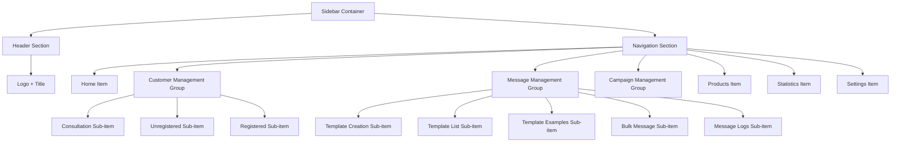
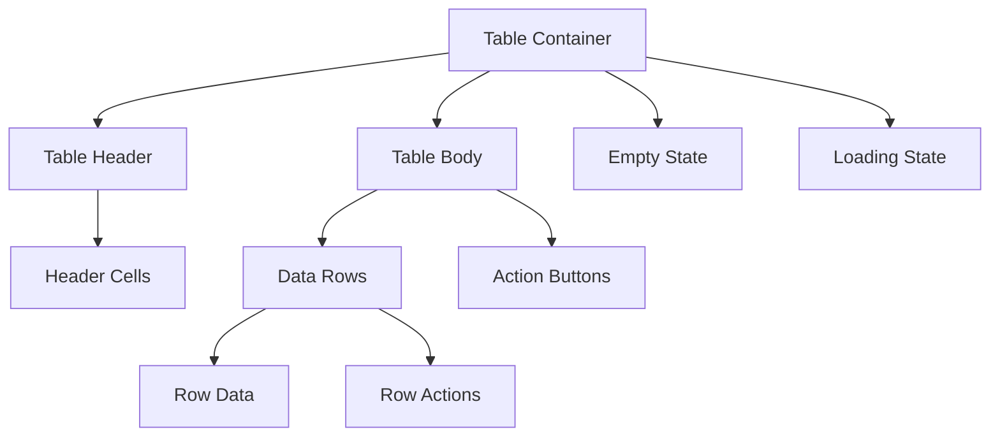
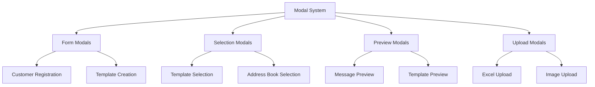
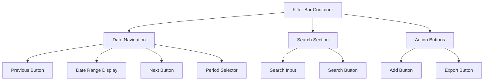
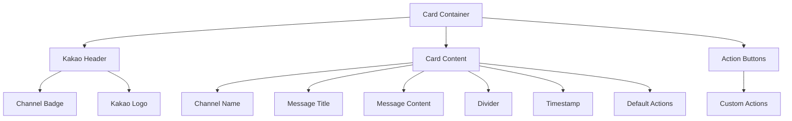
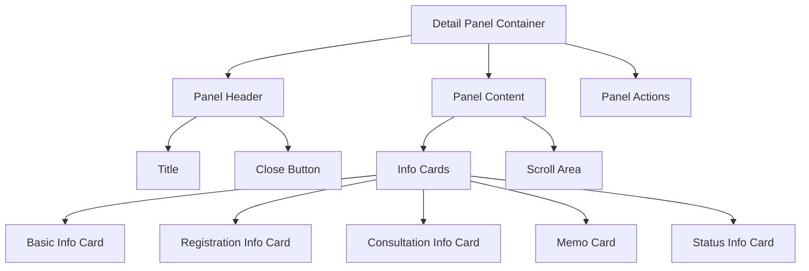

# 🧩 컴포넌트 와이어프레임 - Fitness CRM

## 📋 목차
- [사이드바 네비게이션](#사이드바-네비게이션)
- [테이블 컴포넌트](#테이블-컴포넌트)
- [모달 시스템](#모달-시스템)
- [필터 바](#필터-바)
- [카드 그리드](#카드-그리드)
- [상세 패널](#상세-패널)

---

## 사이드바 네비게이션

### 컴포넌트 구조


### 상세 레이아웃
```
┌─────────────────────────────────────┐
│ Sidebar (w-64 bg-gray-900 text-white)│
│                                     │
│ ┌─────────────────────────────────┐ │
│ │ Header (pt-3 pb-4 pl-2 pr-2)    │ │
│ │ ┌─────────────────────────────┐ │ │
│ │ │ Fitness CRM                 │ │ │
│ │ │ (text-2xl font-semibold)    │ │ │
│ │ └─────────────────────────────┘ │ │
│ └─────────────────────────────────┘ │
│                                     │
│ ┌─────────────────────────────────┐ │
│ │ Navigation (space-y-2)          │ │
│ │                                 │ │
│ │ ┌─────────────────────────────┐ │ │
│ │ │ 🏠 Home                     │ │ │
│ │ │ (py-2.5 px-4 rounded)      │ │ │
│ │ └─────────────────────────────┘ │ │
│ │                                 │ │
│ │ ┌─────────────────────────────┐ │ │
│ │ │ 👥 고객관리 [🔽]            │ │ │
│ │ │ (expandable button)         │ │ │
│ │ └─────────────────────────────┘ │ │
│ │   ┌───────────────────────────┐ │ │
│ │   │ ├ ✅ 상담 고객            │ │ │
│ │   │ ├ ❌ 미등록 고객          │ │ │
│ │   │ └ ➕ 신규 등록 고객        │ │ │
│ │   │ (ml-4 space-y-2)          │ │ │
│ │   └───────────────────────────┘ │ │
│ │                                 │ │
│ │ ┌─────────────────────────────┐ │ │
│ │ │ 💬 메시지 관리 [🔽]         │ │ │
│ │ └─────────────────────────────┘ │ │
│ │   ┌───────────────────────────┐ │ │
│ │   │ ├ 📄 템플릿 만들기         │ │ │
│ │   │ ├ 📄 템플릿 목록           │ │ │
│ │   │ ├ 📄 템플릿 예시 목록      │ │ │
│ │   │ ├ 📧 단체 메시지 발송      │ │ │
│ │   │ └ 📧 메시지 발송 내역      │ │ │
│ │   └───────────────────────────┘ │ │
│ │                                 │ │
│ │ ┌─────────────────────────────┐ │ │
│ │ │ 📧 캠페인 관리 [🔽]         │ │ │
│ │ └─────────────────────────────┘ │ │
│ │   ┌───────────────────────────┐ │ │
│ │   │ ├ 📧 캠페인 만들기         │ │ │
│ │   │ ├ 📧 캠페인 목록           │ │ │
│ │   │ ├ 📧 캠페인 예시 목록      │ │ │
│ │   │ └ 📧 캠페인 성과           │ │ │
│ │   └───────────────────────────┘ │ │
│ │                                 │ │
│ │ ┌─────────────────────────────┐ │ │
│ │ │ 📦 상품/결제관리            │ │ │
│ │ └─────────────────────────────┘ │ │
│ │                                 │ │
│ │ ┌─────────────────────────────┐ │ │
│ │ │ 📊 통계                     │ │ │
│ │ └─────────────────────────────┘ │ │
│ │                                 │ │
│ │ ┌─────────────────────────────┐ │ │
│ │ │ ⚙️ 설정                     │ │ │
│ │ └─────────────────────────────┘ │ │
│ └─────────────────────────────────┘ │
└─────────────────────────────────────┘
```

### 상태 및 인터랙션
```typescript
interface SidebarProps {
  isCollapsed?: boolean;
  activeItem?: string;
  expandedGroups?: string[];
}

interface MenuItemState {
  isActive: boolean;
  isExpanded?: boolean;
  hasChildren?: boolean;
}

// 상태별 스타일
const itemStyles = {
  default: "text-white hover:bg-gray-700",
  active: "bg-blue-600 hover:bg-blue-700",
  expanded: "bg-gray-700"
};
```

### 반응형 동작
- **Mobile (< 768px)**: 오버레이 모드, 전체화면
- **Tablet (768px~1024px)**: 아이콘만 표시, 호버시 확장
- **Desktop (> 1024px)**: 전체 표시

---

## 테이블 컴포넌트

### 컴포넌트 구조


### CustomerTable 상세 구조
```
┌─────────────────────────────────────────────────────────────┐
│ Table Container (overflow-x-auto rounded shadow bg-white)   │
│ ┌─────────────────────────────────────────────────────────┐ │
│ │ Table (min-w-full)                                      │ │
│ │ ┌─────────────────────────────────────────────────────┐ │ │
│ │ │ Header (bg-gray-400 text-white)                     │ │ │
│ │ │ ┌────┬────────┬────────┬────────┬────────┬────────┐ │ │ │
│ │ │ │번호│ 이름   │ 연락처 │ 등록일 │ 회원권 │ 작업   │ │ │ │
│ │ │ │(p-3│ (p-3)  │ (p-3)  │ (p-3)  │ (p-3)  │ (p-3)  │ │ │ │
│ │ │ └────┴────────┴────────┴────────┴────────┴────────┘ │ │ │
│ │ └─────────────────────────────────────────────────────┘ │ │
│ │ ┌─────────────────────────────────────────────────────┐ │ │
│ │ │ Body                                                │ │ │
│ │ │ ┌────┬────────┬────────┬────────┬────────┬────────┐ │ │ │
│ │ │ │ 1  │김철수  │010-1234│2025-01 │ 3개월  │[보기]  │ │ │ │
│ │ │ │(중앙│ (좌)   │ (좌)   │ (좌)   │ (좌)   │[수정]  │ │ │ │
│ │ │ │정렬)│        │        │        │        │[삭제]  │ │ │ │
│ │ │ ├────┼────────┼────────┼────────┼────────┼────────┤ │ │ │
│ │ │ │ 2  │이영희  │010-2345│2025-01 │ PT10   │[보기]  │ │ │ │
│ │ │ │(배경│ (배경   │ (배경   │ (배경   │ (배경   │[수정]  │ │ │ │
│ │ │ │회색)│ 회색)  │ 회색)  │ 회색)  │ 회색)  │[삭제]  │ │ │ │
│ │ │ └────┴────────┴────────┴────────┴────────┴────────┘ │ │ │
│ │ └─────────────────────────────────────────────────────┘ │ │
│ │                                                         │ │
│ │ Empty State (조건부 렌더링)                             │ │
│ │ ┌─────────────────────────────────────────────────────┐ │ │
│ │ │ colspan={전체} className="text-center p-8"          │ │ │
│ │ │ "등록된 고객이 없습니다."                            │ │ │
│ │ │ (text-gray-500)                                     │ │ │
│ │ └─────────────────────────────────────────────────────┘ │ │
│ └─────────────────────────────────────────────────────────┘ │
└─────────────────────────────────────────────────────────────┘
```

### 테이블 타입별 구조
```typescript
interface TableProps {
  customers: ConsultationCustomer[] | RegisteredCustomer[];
  type: 'consultation' | 'registered' | 'unregistered';
  onDetailView?: (customer: RegisteredCustomer) => void;
}

// 상담 고객 테이블 컬럼
const consultationColumns = [
  '번호', '이름', '연락처', '예약일시', '문의경로', 
  '종목', '예약목적', '상담기록', '작업'
];

// 등록 고객 테이블 컬럼  
const registeredColumns = [
  '번호', '이름', '연락처', '등록일', '회원권 종류',
  '결제 방법', '담당 트레이너', '회원번호', '추천회원',
  '생년월일', '주소', '상담기록', '작업'
];
```

### 액션 버튼 패턴
```
상담 고객용:
┌─────────────────────────────────────────┐
│ [상담기록] [상담완료] [수정] [삭제]       │
│ (outline) (green)   (outline) (red)     │
└─────────────────────────────────────────┘

미등록 고객용:
┌─────────────────────────────────────────┐
│ [상담기록] [등록완료] [수정] [삭제]       │
│ (outline) (blue)    (outline) (red)     │
└─────────────────────────────────────────┘

등록 고객용:
┌─────────────────────────────────────────┐
│ [상담기록] [상세보기] [수정] [삭제]       │
│ (outline) (green)   (outline) (red)     │
└─────────────────────────────────────────┘
```

### 뱃지 시스템
```typescript
const statusBadges = {
  '미상담': 'secondary',
  '상담완료': 'default', 
  '미등록': 'destructive',
  '등록완료': 'success',
  '활동': 'default',
  '만료': 'destructive',
  '휴면': 'secondary'
};

const purposeBadges = {
  '상담': 'bg-blue-100 text-blue-700',
  '체험': 'bg-green-100 text-green-700', 
  '등록': 'bg-purple-100 text-purple-700',
  '기타': 'bg-gray-200 text-gray-700'
};
```

---

## 모달 시스템

### 모달 타입별 구조


### 기본 모달 구조
```
Modal Overlay (fixed inset-0 bg-black bg-opacity-50 z-50)
┌─────────────────────────────────────────────────┐
│ Modal Container (bg-white rounded-lg)           │
│ ┌─────────────────────────────────────────────┐ │
│ │ Header (p-4 border-b)                       │ │
│ │ ┌─────────────────────┐ ┌─────────────────┐ │ │
│ │ │ Title               │ │ Close Button [X]│ │ │
│ │ │ (text-lg font-bold) │ │ (variant=ghost) │ │ │
│ │ └─────────────────────┘ └─────────────────┘ │ │
│ └─────────────────────────────────────────────┘ │
│ ┌─────────────────────────────────────────────┐ │
│ │ Content (p-4)                               │ │
│ │                                             │ │
│ │ [Modal specific content]                    │ │
│ │                                             │ │
│ └─────────────────────────────────────────────┘ │
│ ┌─────────────────────────────────────────────┐ │
│ │ Footer (p-4 border-t)                       │ │
│ │ ┌─────────────────────┐ ┌─────────────────┐ │ │
│ │ │ Primary Action      │ │ Secondary Action│ │ │
│ │ │ [확인/저장/선택]     │ │ [취소/닫기]     │ │ │
│ │ └─────────────────────┘ └─────────────────┘ │ │
│ └─────────────────────────────────────────────┘ │
└─────────────────────────────────────────────────┘
```

### 폼 모달 (고객 등록)
```
┌─────────────────────────────────────────────────┐
│ Content Area (max-w-3xl)                        │
│ ┌─────────────────────────────────────────────┐ │
│ │ Form (grid grid-cols-2 gap-4)               │ │
│ │ ┌─────────────────┐ ┌─────────────────────┐ │ │
│ │ │ 이름             │ │ 연락처              │ │ │
│ │ │ [____________]  │ │ [________________] │ │ │
│ │ └─────────────────┘ └─────────────────────┘ │ │
│ │ ┌─────────────────┐ ┌─────────────────────┐ │ │
│ │ │ 예약일시         │ │ 문의경로            │ │ │
│ │ │ [datetime-local]│ │ [select ▼]         │ │ │
│ │ └─────────────────┘ └─────────────────────┘ │ │
│ │ ┌─────────────────┐ ┌─────────────────────┐ │ │
│ │ │ 종목             │ │ 예약목적            │ │ │
│ │ │ [select ▼]      │ │ [select ▼]         │ │ │
│ │ └─────────────────┘ └─────────────────────┘ │ │
│ │ ┌─────────────────────────────────────────┐ │ │
│ │ │ 메모 (col-span-2)                       │ │ │
│ │ │ [_________________________________]    │ │ │
│ │ └─────────────────────────────────────────┘ │ │
│ └─────────────────────────────────────────────┘ │
└─────────────────────────────────────────────────┘
```

### 선택 모달 (템플릿 선택)
```
┌─────────────────────────────────────────────────────────────┐
│ Large Modal (max-w-6xl max-h-90vh flex)                     │
│ ┌─────────────────────────┐ ┌─────────────────────────────┐ │
│ │ Left Panel (w-1/2)      │ │ Right Panel (w-1/2)         │ │
│ │ ┌─────────────────────┐ │ │ ┌─────────────────────────┐ │ │
│ │ │ Search & Actions    │ │ │ │ Preview Header          │ │ │
│ │ │ [새로 만들기]       │ │ │ │ "현재 선택됨"           │ │ │
│ │ │ 검색[____________]   │ │ │ │ ID: KA01TP250708...     │ │ │
│ │ └─────────────────────┘ │ │ └─────────────────────────┘ │ │
│ │ ┌─────────────────────┐ │ │ ┌─────────────────────────┐ │ │
│ │ │ Template List       │ │ │ │ Template Preview        │ │ │
│ │ │ (overflow-y-auto)   │ │ │ │                         │ │ │
│ │ │ ┌─────────────────┐ │ │ │ │ ┌─────────────────────┐ │ │ │
│ │ │ │ Template Card 1 │ │ │ │ │ │ Kakao Style Preview │ │ │ │
│ │ │ │ ⭐[이미지첨부형] │ │ │ │ │ │ (rounded-2xl)       │ │ │ │
│ │ │ │ PT 만족도 조사  │ │ │ │ │ │                     │ │ │ │
│ │ │ │ 2025.07.16      │ │ │ │ │ │ [Template Content]  │ │ │ │
│ │ │ │ [선택하기]      │ │ │ │ │ │                     │ │ │ │
│ │ │ └─────────────────┘ │ │ │ │ └─────────────────────┘ │ │ │
│ │ │ ┌─────────────────┐ │ │ │ │                         │ │ │
│ │ │ │ Template Card 2 │ │ │ │ │                         │ │ │
│ │ │ └─────────────────┘ │ │ │ │                         │ │ │
│ │ └─────────────────────┘ │ │ └─────────────────────────┘ │ │
│ └─────────────────────────┘ └─────────────────────────────┘ │
│ ┌─────────────────────────────────────────────────────────┐ │
│ │ Footer Actions                                          │ │
│ │ ┌─────────────────────┐ ┌─────────────────────────────┐ │ │
│ │ │ [템플릿 선택]       │ │ [닫기 ESC]                  │ │ │
│ │ │ (bg-blue-600)       │ │ (variant=outline)           │ │ │
│ │ └─────────────────────┘ └─────────────────────────────┘ │ │
│ └─────────────────────────────────────────────────────────┘ │
└─────────────────────────────────────────────────────────────┘
```

### 미리보기 모달 (메시지 미리보기)
```
┌─────────────────────────────────────────────────┐
│ Preview Modal (max-w-md)                        │
│ ┌─────────────────────────────────────────────┐ │
│ │ Mobile Simulator (w-80 h-500)               │ │
│ │ ┌─────────────────────────────────────────┐ │ │
│ │ │ Mobile Header                           │ │ │
│ │ │ 📱 문자                          12:34 │ │ │
│ │ └─────────────────────────────────────────┘ │ │
│ │ ┌─────────────────────────────────────────┐ │ │
│ │ │ Message Bubble                          │ │ │
│ │ │ ┌─────────────────────────────────────┐ │ │ │
│ │ │ │ Message Title (font-bold)           │ │ │ │
│ │ │ └─────────────────────────────────────┘ │ │ │
│ │ │ ┌─────────────────────────────────────┐ │ │ │
│ │ │ │ Message Content                     │ │ │ │
│ │ │ │ (whitespace-pre-wrap)               │ │ │ │
│ │ │ └─────────────────────────────────────┘ │ │ │
│ │ │ ┌─────────────────────────────────────┐ │ │ │
│ │ │ │ 광고메시지 - 서비스명               │ │ │ │
│ │ │ │ (text-xs text-gray-500)             │ │ │ │
│ │ │ └─────────────────────────────────────┘ │ │ │
│ │ └─────────────────────────────────────────┘ │ │
│ │ ┌─────────────────────────────────────────┐ │ │
│ │ │ Sender Info                             │ │ │
│ │ │ 발신자: 010-8762-9905                   │ │ │
│ │ │ (text-xs text-center)                   │ │ │
│ │ └─────────────────────────────────────────┘ │ │
│ └─────────────────────────────────────────────┘ │
└─────────────────────────────────────────────────┘
```

---

## 필터 바

### 컴포넌트 구조


### 상세 레이아웃
```
┌─────────────────────────────────────────────────────────────┐
│ Filter Bar (flex justify-between items-center mb-4 gap-4)   │
│ ┌─────────────────────────────────────────┐ ┌─────────────┐ │
│ │ Left Section                            │ │ Right Sec   │ │
│ │ ┌───┐ ┌─────────────────┐ ┌───┐ ┌─────┐ │ │             │ │
│ │ │[◀]│ │2025-01-01      │ │[▶]│ │전체▼│ │ │ ┌─────────┐ │ │
│ │ │   │ │~2025-01-31     │ │   │ │     │ │ │ │[+ 추가] │ │ │
│ │ │   │ │(text-center)   │ │   │ │     │ │ │ │(colored)│ │ │
│ │ └───┘ └─────────────────┘ └───┘ └─────┘ │ │ └─────────┘ │ │
│ │ ┌─────────────────────────────────────┐ │ │             │ │
│ │ │ Search Section                      │ │ │             │ │
│ │ │ ┌─────────────────┐ ┌─────────────┐ │ │ │             │ │
│ │ │ │ 🔍 검색입력      │ │ [검색]      │ │ │ │             │ │
│ │ │ │ (relative)      │ │ (bg-blue)   │ │ │ │             │ │
│ │ │ │ ┌─────────────┐ │ │             │ │ │ │             │ │
│ │ │ │ │이름,연락처로│ │ │             │ │ │ │             │ │
│ │ │ │ │검색(pl-10)  │ │ │             │ │ │ │             │ │
│ │ │ │ └─────────────┘ │ │             │ │ │ │             │ │
│ │ │ └─────────────────┘ └─────────────┘ │ │ │             │ │
│ │ └─────────────────────────────────────┘ │ │             │ │
│ └─────────────────────────────────────────┘ └─────────────┘ │
└─────────────────────────────────────────────────────────────┘
```

### 날짜 네비게이션 상세
```typescript
interface DateNavigationProps {
  startDate: string;
  endDate: string;
  onDateRangeChange: (type: DateRangeType) => void;
}

type DateRangeType = 
  | 'all' | 'today' | 'yesterday' 
  | 'thisWeek' | 'thisMonth' | 'lastMonth';

const dateRangeOptions = [
  { value: 'all', label: '전체' },
  { value: 'today', label: '오늘' },
  { value: 'thisWeek', label: '이번주' },
  { value: 'lastWeek', label: '지난주' },
  { value: 'thisMonth', label: '이번달' },
  { value: 'lastMonth', label: '지난달' }
];
```

### 검색 입력 패턴
```
Search Input with Icon:
┌─────────────────────────────────────┐
│ 🔍 Input Field                      │
│ ├── Icon (absolute left-3)          │
│ ├── Placeholder Text                │
│ ├── Input (pl-10 w-64)              │
│ └── Clear Button (조건부)           │
└─────────────────────────────────────┘

Search Button Variants:
- Primary: bg-blue-600 hover:bg-blue-700
- Outline: variant="outline" 
- Icon Only: size="icon"
```

---

## 카드 그리드

### 카카오 스타일 템플릿 카드


### 카드 상세 구조
```
┌─────────────────────────────────────────────────┐
│ Card Container (rounded-2xl shadow-xl h-full)   │
│ ┌─────────────────────────────────────────────┐ │
│ │ Kakao Header (bg-yellow-400 px-4 py-2)      │ │
│ │ ┌─────────────────────┐ ┌─────────────────┐ │ │
│ │ │ 알림톡 도착          │ │ [kakao]         │ │ │
│ │ │ (text-xs font-bold) │ │ (rounded-full)  │ │ │
│ │ │ (text-gray-700)     │ │ (bg-black)      │ │ │
│ │ └─────────────────────┘ └─────────────────┘ │ │
│ └─────────────────────────────────────────────┘ │
│ ┌─────────────────────────────────────────────┐ │
│ │ Content Area (bg-white px-3 py-2 flex-1)    │ │
│ │ ┌─────────────────────────────────────────┐ │ │
│ │ │ Channel Name                            │ │ │
│ │ │ 스테이피트니스 둔전점                   │ │ │
│ │ │ (text-xs text-gray-400 mb-1)            │ │ │
│ │ └─────────────────────────────────────────┘ │ │
│ │ ┌─────────────────────────────────────────┐ │ │
│ │ │ Message Title                           │ │ │
│ │ │ PT 만족도 조사 참여 안내                │ │ │
│ │ │ (text-base font-bold mb-2)              │ │ │
│ │ │ (line-height: 1.2)                      │ │ │
│ │ └─────────────────────────────────────────┘ │ │
│ │ ┌─────────────────────────────────────────┐ │ │
│ │ │ Message Subtitle                        │ │ │
│ │ │ 소중한 의견을 들려주세요                │ │ │
│ │ │ (text-sm font-semibold mb-2)            │ │ │
│ │ └─────────────────────────────────────────┘ │ │
│ │ ┌─────────────────────────────────────────┐ │ │
│ │ │ Message Body                            │ │ │
│ │ │ 현재 수업을 받고 계신 회원님들을         │ │ │
│ │ │ 대상으로 만족도 조사를 진행...          │ │ │
│ │ │ (text-xs whitespace-pre-line mb-3)      │ │ │
│ │ └─────────────────────────────────────────┘ │ │
│ │ ┌─────────────────────────────────────────┐ │ │
│ │ │ Divider (border-t border-gray-200)      │ │ │
│ │ └─────────────────────────────────────────┘ │ │
│ │ ┌─────────────────────────────────────────┐ │ │
│ │ │ Timestamp & Footer                      │ │ │
│ │ │ 2025년 07월 16일 오전 12:14             │ │ │
│ │ │ (text-xs text-gray-500 mb-2)            │ │ │
│ │ └─────────────────────────────────────────┘ │ │
│ │ ┌─────────────────────────────────────────┐ │ │
│ │ │ Default Kakao Actions                   │ │ │
│ │ │ ┌─────────────────────────────────────┐ │ │ │
│ │ │ │ [채널 추가]                         │ │ │ │
│ │ │ │ (bg-yellow-400 w-full py-1.5)       │ │ │ │
│ │ │ └─────────────────────────────────────┘ │ │ │
│ │ │ ┌─────────────────────────────────────┐ │ │ │
│ │ │ │ [리뷰 작성하기]                     │ │ │ │
│ │ │ │ (bg-gray-100 w-full py-1.5)         │ │ │ │
│ │ │ └─────────────────────────────────────┘ │ │ │
│ │ └─────────────────────────────────────────┘ │ │
│ │ ┌─────────────────────────────────────────┐ │ │
│ │ │ Custom Actions (flex gap-2)             │ │ │
│ │ │ ┌─────────────────┐ ┌─────────────────┐ │ │ │
│ │ │ │ [수정]          │ │ [삭제]          │ │ │ │
│ │ │ │ (bg-blue-600)   │ │ (bg-red-600)    │ │ │ │
│ │ │ │ (flex-1)        │ │ (flex-1)        │ │ │ │
│ │ │ └─────────────────┘ └─────────────────┘ │ │ │
│ │ └─────────────────────────────────────────┘ │ │
│ └─────────────────────────────────────────────┘ │
└─────────────────────────────────────────────────┘
```

### 그리드 레이아웃
```css
/* 반응형 그리드 */
.template-grid {
  display: grid;
  grid-template-columns: repeat(1, 1fr);
  gap: 1rem;
}

@media (min-width: 640px) {
  .template-grid {
    grid-template-columns: repeat(2, 1fr);
  }
}

@media (min-width: 768px) {
  .template-grid {
    grid-template-columns: repeat(3, 1fr);
  }
}

@media (min-width: 1280px) {
  .template-grid {
    grid-template-columns: repeat(4, 1fr);
  }
}
```

### 카드 상태별 스타일
```typescript
interface CardState {
  isSelected?: boolean;
  isFavorite?: boolean;
  isRecentlyUsed?: boolean;
  status?: 'active' | 'inactive' | 'pending';
}

const cardVariants = {
  default: "border-gray-200 hover:border-blue-300",
  selected: "border-blue-500 ring-2 ring-blue-200",
  favorite: "border-yellow-400 ring-1 ring-yellow-200",
  inactive: "opacity-60 border-gray-300"
};
```

---

## 상세 패널

### 컴포넌트 구조


### 상세 레이아웃
```
Side Panel (fixed inset-0 z-50 flex)
┌─────────────────────────────────────────────────┐
│ ┌─────────────────┐ ┌─────────────────────────┐ │
│ │ Backdrop        │ │ Panel (w-1/2 ml-auto)   │ │
│ │ (투명/클릭가능)  │ │                         │ │
│ │                 │ │ ┌─────────────────────┐ │ │
│ │                 │ │ │ Header              │ │ │
│ │                 │ │ │ ┌─────────────────┐ │ │ │
│ │                 │ │ │ │ 고객 상세정보   │ │ │ │
│ │                 │ │ │ │ (text-xl)       │ │ │ │
│ │                 │ │ │ └─────────────────┘ │ │ │
│ │                 │ │ │ ┌─────────────────┐ │ │ │
│ │                 │ │ │ │ [X] Close       │ │ │ │
│ │                 │ │ │ │ (absolute)      │ │ │ │
│ │                 │ │ │ └─────────────────┘ │ │ │
│ │                 │ │ └─────────────────────┘ │ │
│ │                 │ │ ┌─────────────────────┐ │ │
│ │                 │ │ │ Content             │ │ │
│ │                 │ │ │ (overflow-y-auto)   │ │ │
│ │                 │ │ │                     │ │ │
│ │                 │ │ │ 기본 정보 Card       │ │ │
│ │                 │ │ │ ┌─────────────────┐ │ │ │
│ │                 │ │ │ │ 이름: 김철수     │ │ │ │
│ │                 │ │ │ │ 연락처: 010-... │ │ │ │
│ │                 │ │ │ │ 생년월일: -     │ │ │ │
│ │                 │ │ │ │ 주소: -         │ │ │ │
│ │                 │ │ │ └─────────────────┘ │ │ │
│ │                 │ │ │                     │ │ │
│ │                 │ │ │ 등록 정보 Card       │ │ │
│ │                 │ │ │ ┌─────────────────┐ │ │ │
│ │                 │ │ │ │ 등록일: 2025-01 │ │ │ │
│ │                 │ │ │ │ 회원권: 3개월   │ │ │ │
│ │                 │ │ │ │ 결제방법: -     │ │ │ │
│ │                 │ │ │ │ 트레이너: 김T   │ │ │ │
│ │                 │ │ │ └─────────────────┘ │ │ │
│ │                 │ │ │                     │ │ │
│ │                 │ │ │ 상담 정보 Card       │ │ │
│ │                 │ │ │ 메모 Card           │ │ │
│ │                 │ │ │ 상태 정보 Card       │ │ │
│ │                 │ │ │                     │ │ │
│ │                 │ │ └─────────────────────┘ │ │
│ └─────────────────┘ └─────────────────────────┘ │
└─────────────────────────────────────────────────┘
```

### 정보 카드 패턴
```
Info Card Structure:
┌─────────────────────────────────────────────────┐
│ Card (bg-white rounded-lg border p-4)           │
│ ┌─────────────────────────────────────────────┐ │
│ │ Card Header                                 │ │
│ │ 기본 정보 (text-lg font-semibold mb-3)      │ │
│ └─────────────────────────────────────────────┘ │
│ ┌─────────────────────────────────────────────┐ │
│ │ Card Content (space-y-3)                    │ │
│ │ ┌─────────────────────────────────────────┐ │ │
│ │ │ Info Row (flex justify-between)         │ │ │
│ │ │ ┌─────────────────┐ ┌─────────────────┐ │ │ │
│ │ │ │ Label           │ │ Value           │ │ │ │
│ │ │ │ (text-gray-600) │ │ (font-medium)   │ │ │ │
│ │ │ └─────────────────┘ └─────────────────┘ │ │ │
│ │ └─────────────────────────────────────────┘ │ │
│ │ ┌─────────────────────────────────────────┐ │ │
│ │ │ Info Row...                             │ │ │
│ │ └─────────────────────────────────────────┘ │ │
│ └─────────────────────────────────────────────┘ │
└─────────────────────────────────────────────────┘
```

### 메모 카드 특별 구조
```
Memo Card:
┌─────────────────────────────────────────────────┐
│ ┌─────────────────────────────────────────────┐ │
│ │ 메모 (text-lg font-semibold mb-3)           │ │
│ └─────────────────────────────────────────────┘ │
│ ┌─────────────────────────────────────────────┐ │
│ │ Memo Content (bg-gray-50 p-3 rounded)       │ │
│ │ ┌─────────────────────────────────────────┐ │ │
│ │ │ 메모 내용 또는 "메모가 없습니다."       │ │ │
│ │ │ (text-gray-700)                         │ │ │
│ │ └─────────────────────────────────────────┘ │ │
│ └─────────────────────────────────────────────┘ │
└─────────────────────────────────────────────────┘
```

### 패널 애니메이션
```typescript
// 패널 열기/닫기 애니메이션
const panelVariants = {
  hidden: { 
    x: '100%',
    opacity: 0 
  },
  visible: { 
    x: 0,
    opacity: 1,
    transition: { duration: 0.3, ease: 'easeOut' }
  },
  exit: { 
    x: '100%',
    opacity: 0,
    transition: { duration: 0.2, ease: 'easeIn' }
  }
};

// 메인 콘텐츠 축소 애니메이션
const contentVariants = {
  normal: { marginRight: 0 },
  compressed: { 
    marginRight: '50%',
    transition: { duration: 0.3 }
  }
};
```

---

## 공통 패턴 및 가이드라인

### 색상 시스템
```typescript
const colors = {
  primary: {
    50: '#eff6ff',
    600: '#2563eb',
    700: '#1d4ed8'
  },
  gray: {
    50: '#f9fafb',
    100: '#f3f4f6',
    400: '#9ca3af',
    500: '#6b7280',
    600: '#4b5563',
    900: '#111827'
  },
  success: {
    100: '#dcfce7',
    600: '#16a34a',
    700: '#15803d'
  },
  destructive: {
    100: '#fee2e2',
    600: '#dc2626',
    700: '#b91c1c'
  }
};
```

### 간격 시스템
```css
/* Tailwind 기본 간격 사용 */
.spacing-sm { padding: 0.5rem; }  /* p-2 */
.spacing-md { padding: 1rem; }    /* p-4 */
.spacing-lg { padding: 1.5rem; }  /* p-6 */
.spacing-xl { padding: 2rem; }    /* p-8 */

/* 컴포넌트간 간격 */
.component-gap { gap: 1rem; }     /* gap-4 */
.section-gap { gap: 1.5rem; }     /* gap-6 */
```

### 타이포그래피
```css
.text-heading-1 { font-size: 1.875rem; font-weight: 800; } /* text-3xl font-extrabold */
.text-heading-2 { font-size: 1.5rem; font-weight: 700; }   /* text-2xl font-bold */
.text-heading-3 { font-size: 1.25rem; font-weight: 600; }  /* text-xl font-semibold */
.text-body { font-size: 0.875rem; }                        /* text-sm */
.text-caption { font-size: 0.75rem; color: #6b7280; }      /* text-xs text-gray-500 */
```

### 반응형 규칙
```css
/* 모바일 우선 설계 */
.responsive-grid {
  grid-template-columns: 1fr;
}

@media (min-width: 640px) {
  .responsive-grid {
    grid-template-columns: repeat(2, 1fr);
  }
}

@media (min-width: 1024px) {
  .responsive-grid {
    grid-template-columns: repeat(3, 1fr);
  }
}
```

---

**다음 단계**: 사용자 플로우 다이어그램 및 상호작용 정의