# 🔄 사용자 플로우 다이어그램 - Fitness CRM

## 📋 목차
- [고객 등록 플로우](#고객-등록-플로우)
- [메시지 발송 플로우](#메시지-발송-플로우)
- [캠페인 생성 플로우](#캠페인-생성-플로우)
- [통계 조회 플로우](#통계-조회-플로우)

---

## 고객 등록 플로우

### 전체 플로우 개요
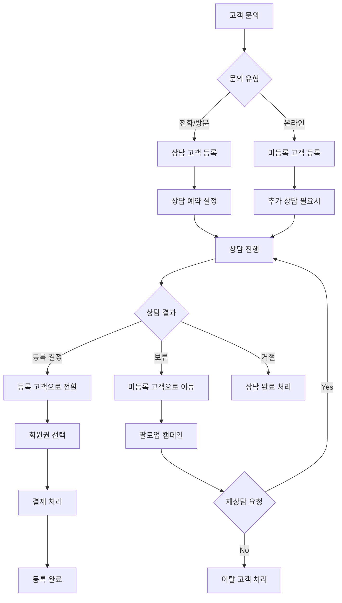
```mermaid
graph TD
    A[고객 문의] --> B{문의 유형}
    B -->|전화/방문| C[상담 고객 등록]
    B -->|온라인| D[미등록 고객 등록]
    
    C --> E[상담 예약 설정]
    E --> F[상담 진행]
    F --> G{상담 결과}
    
    G -->|등록 결정| H[등록 고객으로 전환]
    G -->|보류| I[미등록 고객으로 이동]
    G -->|거절| J[상담 완료 처리]
    
    D --> K[추가 상담 필요시]
    K --> F
    
    H --> L[회원권 선택]
    L --> M[결제 처리]
    M --> N[등록 완료]
    
    I --> O[팔로업 캠페인]
    O --> P{재상담 요청}
    P -->|Yes| F
    P -->|No| Q[이탈 고객 처리]
```

### 상세 플로우 - 상담 고객 등록
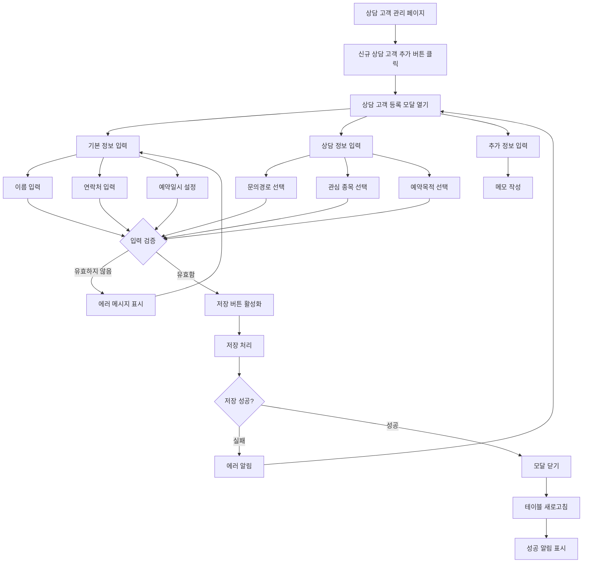
```mermaid
graph TD
    A[상담 고객 관리 페이지] --> B[신규 상담 고객 추가 버튼 클릭]
    B --> C[상담 고객 등록 모달 열기]
    
    C --> D[기본 정보 입력]
    D --> E[이름 입력]
    D --> F[연락처 입력]
    D --> G[예약일시 설정]
    
    C --> H[상담 정보 입력]
    H --> I[문의경로 선택]
    H --> J[관심 종목 선택]
    H --> K[예약목적 선택]
    
    C --> L[추가 정보 입력]
    L --> M[메모 작성]
    
    E --> N{입력 검증}
    F --> N
    G --> N
    I --> N
    J --> N
    K --> N
    
    N -->|유효하지 않음| O[에러 메시지 표시]
    O --> D
    
    N -->|유효함| P[저장 버튼 활성화]
    P --> Q[저장 처리]
    Q --> R{저장 성공?}
    
    R -->|실패| S[에러 알림]
    S --> C
    
    R -->|성공| T[모달 닫기]
    T --> U[테이블 새로고침]
    U --> V[성공 알림 표시]
```

### 상세 플로우 - 등록 고객 전환
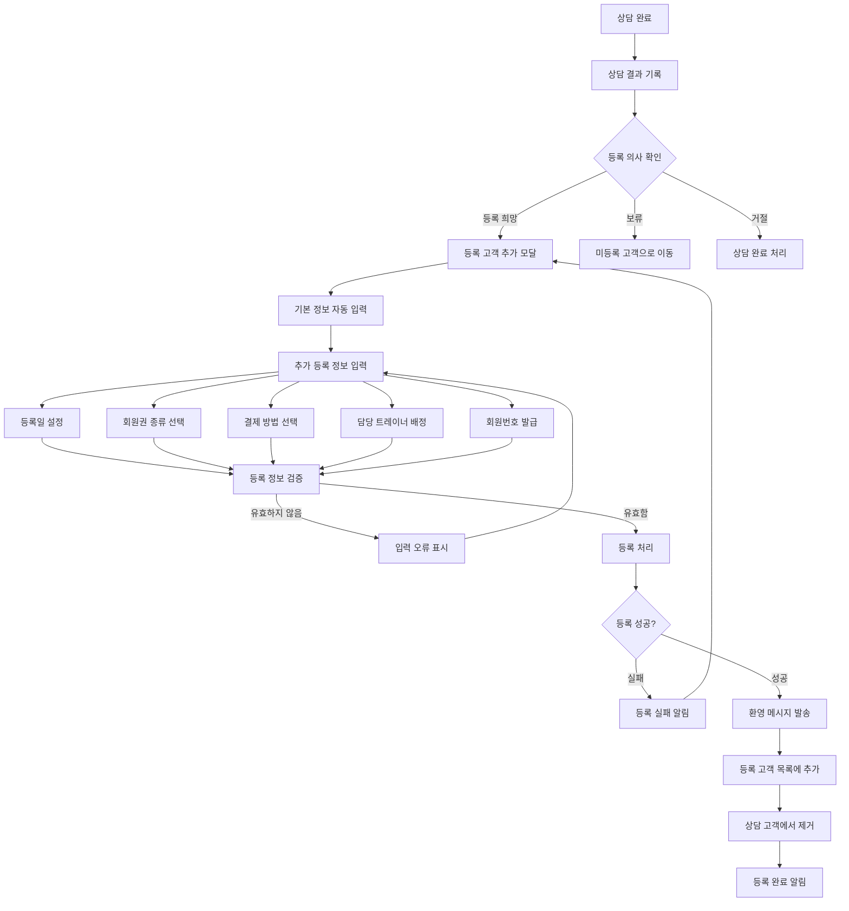
```mermaid
graph TD
    A[상담 완료] --> B[상담 결과 기록]
    B --> C{등록 의사 확인}
    
    C -->|등록 희망| D[등록 고객 추가 모달]
    C -->|보류| E[미등록 고객으로 이동]
    C -->|거절| F[상담 완료 처리]
    
    D --> G[기본 정보 자동 입력]
    G --> H[추가 등록 정보 입력]
    
    H --> I[등록일 설정]
    H --> J[회원권 종류 선택]
    H --> K[결제 방법 선택]
    H --> L[담당 트레이너 배정]
    H --> M[회원번호 발급]
    
    I --> N[등록 정보 검증]
    J --> N
    K --> N
    L --> N
    M --> N
    
    N -->|유효하지 않음| O[입력 오류 표시]
    O --> H
    
    N -->|유효함| P[등록 처리]
    P --> Q{등록 성공?}
    
    Q -->|실패| R[등록 실패 알림]
    R --> D
    
    Q -->|성공| S[환영 메시지 발송]
    S --> T[등록 고객 목록에 추가]
    T --> U[상담 고객에서 제거]
    U --> V[등록 완료 알림]
```

---

## 메시지 발송 플로우

### 전체 메시지 발송 플로우
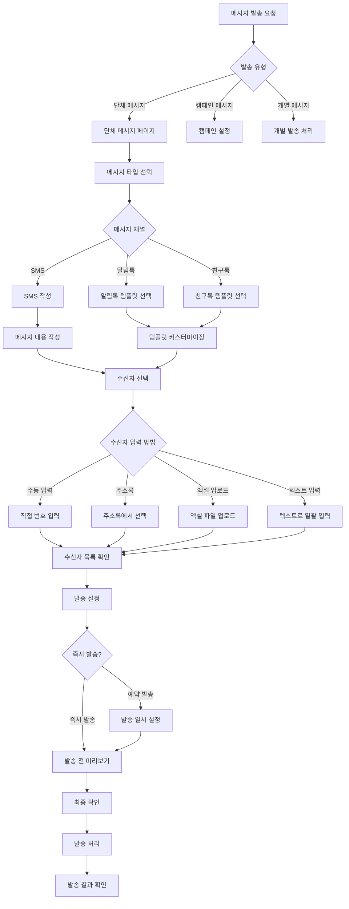
```mermaid
graph TD
    A[메시지 발송 요청] --> B{발송 유형}
    
    B -->|단체 메시지| C[단체 메시지 페이지]
    B -->|캠페인 메시지| D[캠페인 설정]
    B -->|개별 메시지| E[개별 발송 처리]
    
    C --> F[메시지 타입 선택]
    F --> G{메시지 채널}
    
    G -->|SMS| H[SMS 작성]
    G -->|알림톡| I[알림톡 템플릿 선택]
    G -->|친구톡| J[친구톡 템플릿 선택]
    
    H --> K[메시지 내용 작성]
    I --> L[템플릿 커스터마이징]
    J --> L
    
    K --> M[수신자 선택]
    L --> M
    
    M --> N{수신자 입력 방법}
    N -->|수동 입력| O[직접 번호 입력]
    N -->|주소록| P[주소록에서 선택]
    N -->|엑셀 업로드| Q[엑셀 파일 업로드]
    N -->|텍스트 입력| R[텍스트로 일괄 입력]
    
    O --> S[수신자 목록 확인]
    P --> S
    Q --> S
    R --> S
    
    S --> T[발송 설정]
    T --> U{즉시 발송?}
    
    U -->|즉시 발송| V[발송 전 미리보기]
    U -->|예약 발송| W[발송 일시 설정]
    W --> V
    
    V --> X[최종 확인]
    X --> Y[발송 처리]
    Y --> Z[발송 결과 확인]
```

### 상세 플로우 - 템플릿 선택
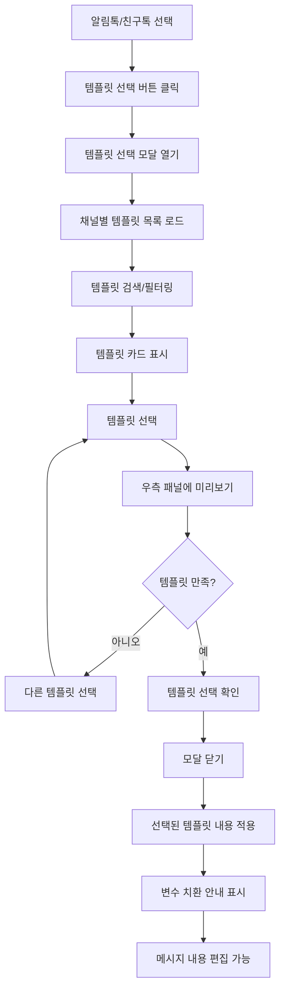
```mermaid
graph TD
    A[알림톡/친구톡 선택] --> B[템플릿 선택 버튼 클릭]
    B --> C[템플릿 선택 모달 열기]
    
    C --> D[채널별 템플릿 목록 로드]
    D --> E[템플릿 검색/필터링]
    
    E --> F[템플릿 카드 표시]
    F --> G[템플릿 선택]
    G --> H[우측 패널에 미리보기]
    
    H --> I{템플릿 만족?}
    I -->|아니오| J[다른 템플릿 선택]
    J --> G
    
    I -->|예| K[템플릿 선택 확인]
    K --> L[모달 닫기]
    L --> M[선택된 템플릿 내용 적용]
    
    M --> N[변수 치환 안내 표시]
    N --> O[메시지 내용 편집 가능]
```

### 상세 플로우 - 수신자 관리
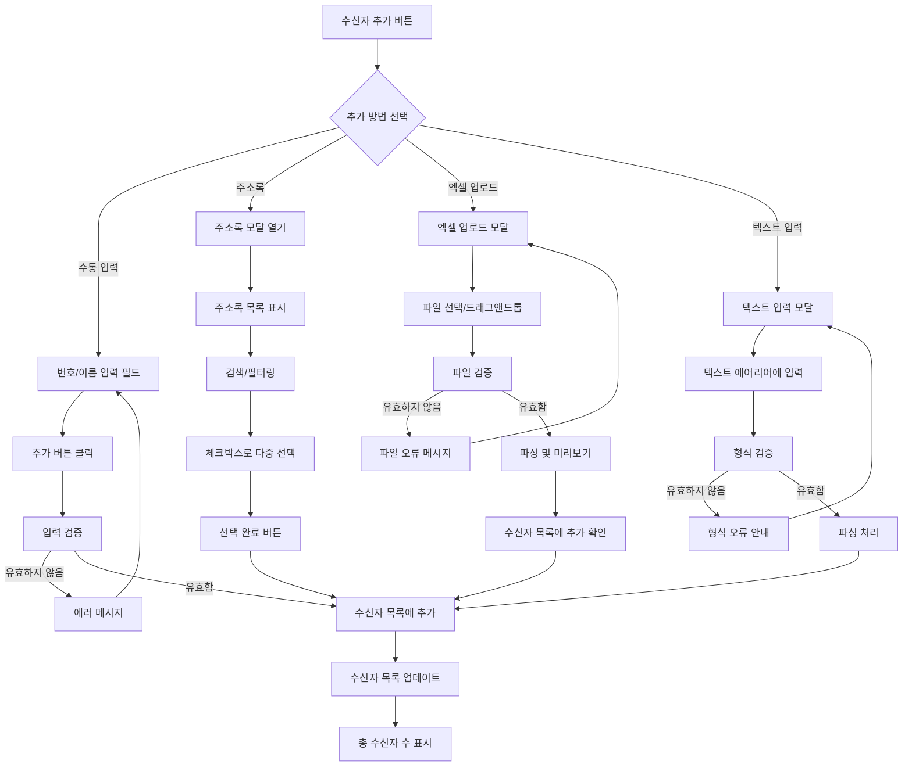
```mermaid
graph TD
    A[수신자 추가 버튼] --> B{추가 방법 선택}
    
    B -->|수동 입력| C[번호/이름 입력 필드]
    B -->|주소록| D[주소록 모달 열기]
    B -->|엑셀 업로드| E[엑셀 업로드 모달]
    B -->|텍스트 입력| F[텍스트 입력 모달]
    
    C --> G[추가 버튼 클릭]
    G --> H[입력 검증]
    H -->|유효하지 않음| I[에러 메시지]
    I --> C
    H -->|유효함| J[수신자 목록에 추가]
    
    D --> K[주소록 목록 표시]
    K --> L[검색/필터링]
    L --> M[체크박스로 다중 선택]
    M --> N[선택 완료 버튼]
    N --> J
    
    E --> O[파일 선택/드래그앤드롭]
    O --> P[파일 검증]
    P -->|유효하지 않음| Q[파일 오류 메시지]
    Q --> E
    P -->|유효함| R[파싱 및 미리보기]
    R --> S[수신자 목록에 추가 확인]
    S --> J
    
    F --> T[텍스트 에어리어에 입력]
    T --> U[형식 검증]
    U -->|유효하지 않음| V[형식 오류 안내]
    V --> F
    U -->|유효함| W[파싱 처리]
    W --> J
    
    J --> X[수신자 목록 업데이트]
    X --> Y[총 수신자 수 표시]
```

---

## 캠페인 생성 플로우

### 전체 캠페인 생성 플로우
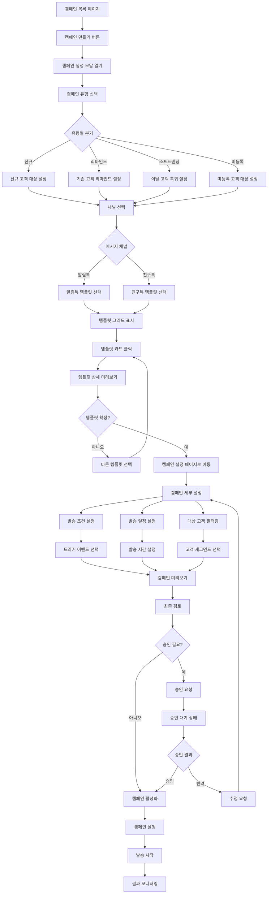
```mermaid
graph TD
    A[캠페인 목록 페이지] --> B[캠페인 만들기 버튼]
    B --> C[캠페인 생성 모달 열기]
    
    C --> D[캠페인 유형 선택]
    D --> E{유형별 분기}
    
    E -->|신규| F[신규 고객 대상 설정]
    E -->|리마인드| G[기존 고객 리마인드 설정]
    E -->|소프트랜딩| H[이탈 고객 복귀 설정]
    E -->|미등록| I[미등록 고객 대상 설정]
    
    F --> J[채널 선택]
    G --> J
    H --> J
    I --> J
    
    J --> K{메시지 채널}
    K -->|알림톡| L[알림톡 템플릿 선택]
    K -->|친구톡| M[친구톡 템플릿 선택]
    
    L --> N[템플릿 그리드 표시]
    M --> N
    
    N --> O[템플릿 카드 클릭]
    O --> P[템플릿 상세 미리보기]
    P --> Q{템플릿 확정?}
    
    Q -->|아니오| R[다른 템플릿 선택]
    R --> O
    
    Q -->|예| S[캠페인 설정 페이지로 이동]
    S --> T[캠페인 세부 설정]
    
    T --> U[발송 조건 설정]
    T --> V[발송 일정 설정]
    T --> W[대상 고객 필터링]
    
    U --> X[트리거 이벤트 선택]
    V --> Y[발송 시간 설정]
    W --> Z[고객 세그먼트 선택]
    
    X --> AA[캠페인 미리보기]
    Y --> AA
    Z --> AA
    
    AA --> BB[최종 검토]
    BB --> CC{승인 필요?}
    
    CC -->|예| DD[승인 요청]
    CC -->|아니오| EE[캠페인 활성화]
    
    DD --> FF[승인 대기 상태]
    FF --> GG{승인 결과}
    GG -->|승인| EE
    GG -->|반려| HH[수정 요청]
    HH --> T
    
    EE --> II[캠페인 실행]
    II --> JJ[발송 시작]
    JJ --> KK[결과 모니터링]
```

### 상세 플로우 - 템플릿 선택 및 커스터마이징
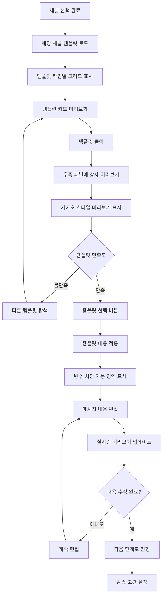
```mermaid
graph TD
    A[채널 선택 완료] --> B[해당 채널 템플릿 로드]
    B --> C[템플릿 타입별 그리드 표시]
    
    C --> D[템플릿 카드 미리보기]
    D --> E[템플릿 클릭]
    E --> F[우측 패널에 상세 미리보기]
    
    F --> G[카카오 스타일 미리보기 표시]
    G --> H{템플릿 만족도}
    
    H -->|불만족| I[다른 템플릿 탐색]
    I --> D
    
    H -->|만족| J[템플릿 선택 버튼]
    J --> K[템플릿 내용 적용]
    
    K --> L[변수 치환 가능 영역 표시]
    L --> M[메시지 내용 편집]
    M --> N[실시간 미리보기 업데이트]
    
    N --> O{내용 수정 완료?}
    O -->|아니오| P[계속 편집]
    P --> M
    
    O -->|예| Q[다음 단계로 진행]
    Q --> R[발송 조건 설정]
```

### 상세 플로우 - 발송 조건 및 일정 설정
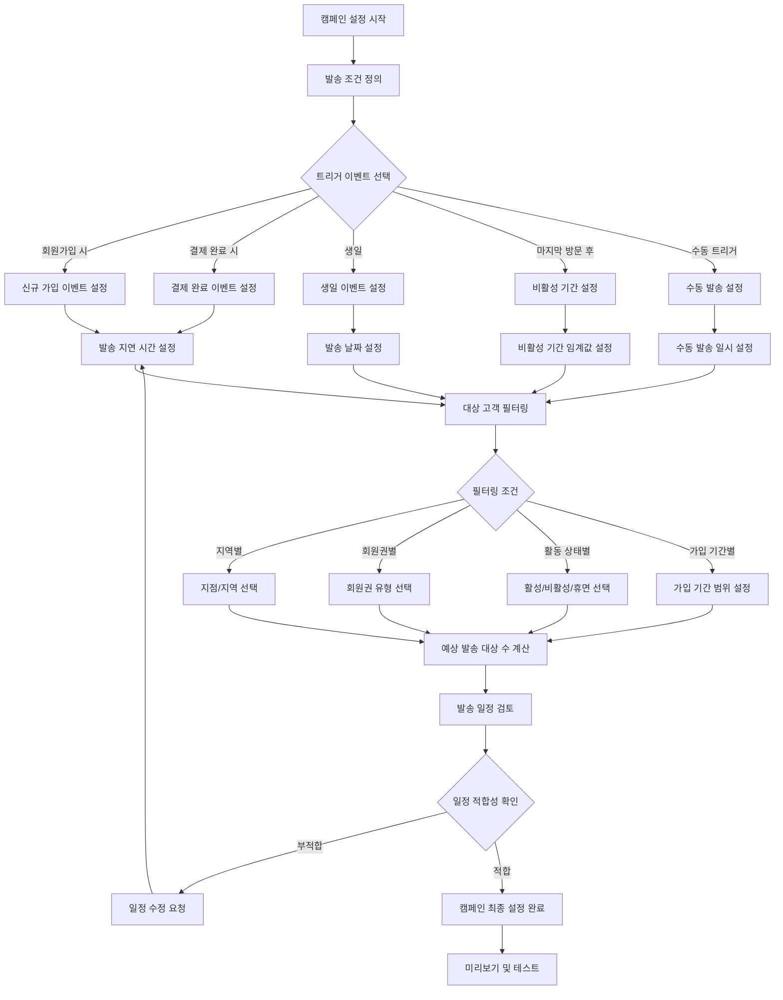
```mermaid
graph TD
    A[캠페인 설정 시작] --> B[발송 조건 정의]
    B --> C{트리거 이벤트 선택}
    
    C -->|회원가입 시| D[신규 가입 이벤트 설정]
    C -->|결제 완료 시| E[결제 완료 이벤트 설정]
    C -->|생일| F[생일 이벤트 설정]
    C -->|마지막 방문 후| G[비활성 기간 설정]
    C -->|수동 트리거| H[수동 발송 설정]
    
    D --> I[발송 지연 시간 설정]
    E --> I
    F --> J[발송 날짜 설정]
    G --> K[비활성 기간 임계값 설정]
    H --> L[수동 발송 일시 설정]
    
    I --> M[대상 고객 필터링]
    J --> M
    K --> M
    L --> M
    
    M --> N{필터링 조건}
    N -->|지역별| O[지점/지역 선택]
    N -->|회원권별| P[회원권 유형 선택]
    N -->|활동 상태별| Q[활성/비활성/휴면 선택]
    N -->|가입 기간별| R[가입 기간 범위 설정]
    
    O --> S[예상 발송 대상 수 계산]
    P --> S
    Q --> S
    R --> S
    
    S --> T[발송 일정 검토]
    T --> U{일정 적합성 확인}
    
    U -->|부적합| V[일정 수정 요청]
    V --> I
    
    U -->|적합| W[캠페인 최종 설정 완료]
    W --> X[미리보기 및 테스트]
```

---

## 통계 조회 플로우

### 전체 통계 조회 플로우
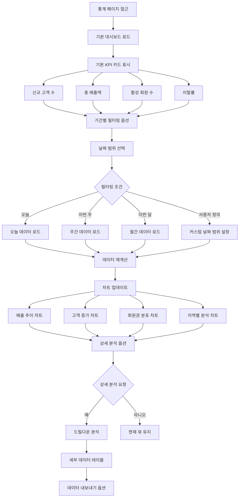
```mermaid
graph TD
    A[통계 페이지 접근] --> B[기본 대시보드 로드]
    B --> C[기본 KPI 카드 표시]
    
    C --> D[신규 고객 수]
    C --> E[총 매출액]
    C --> F[활성 회원 수]
    C --> G[이탈률]
    
    D --> H[기간별 필터링 옵션]
    E --> H
    F --> H
    G --> H
    
    H --> I[날짜 범위 선택]
    I --> J{필터링 조건}
    
    J -->|오늘| K[오늘 데이터 로드]
    J -->|이번 주| L[주간 데이터 로드]
    J -->|이번 달| M[월간 데이터 로드]
    J -->|사용자 정의| N[커스텀 날짜 범위 설정]
    
    K --> O[데이터 재계산]
    L --> O
    M --> O
    N --> O
    
    O --> P[차트 업데이트]
    P --> Q[매출 추이 차트]
    P --> R[고객 증가 차트]
    P --> S[회원권 분포 차트]
    P --> T[지역별 분석 차트]
    
    Q --> U[상세 분석 옵션]
    R --> U
    S --> U
    T --> U
    
    U --> V{상세 분석 요청}
    V -->|예| W[드릴다운 분석]
    V -->|아니오| X[현재 뷰 유지]
    
    W --> Y[세부 데이터 테이블]
    Y --> Z[데이터 내보내기 옵션]
```

### 상세 플로우 - 차트 인터랙션
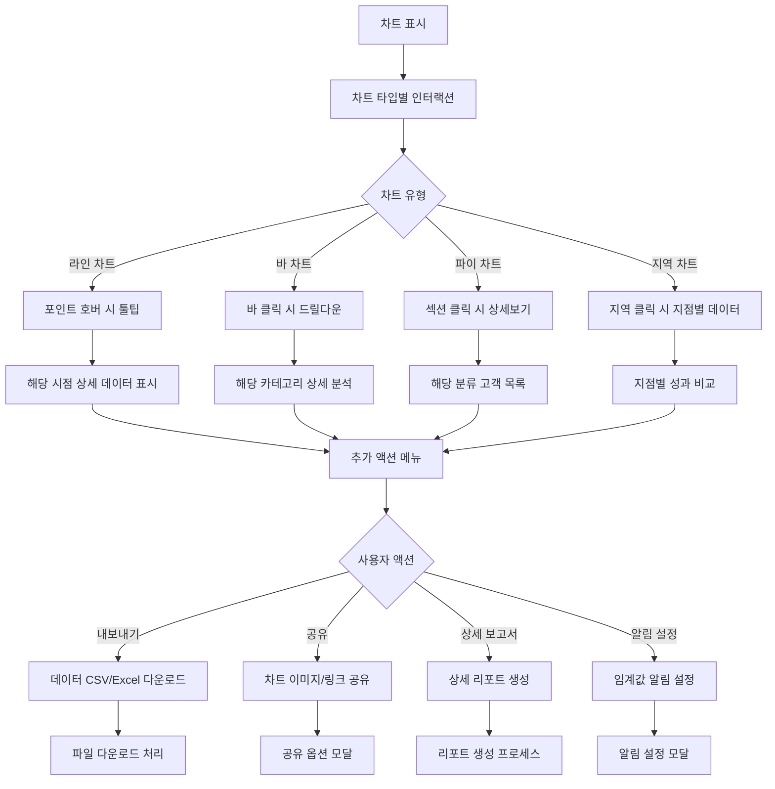
```mermaid
graph TD
    A[차트 표시] --> B[차트 타입별 인터랙션]
    B --> C{차트 유형}
    
    C -->|라인 차트| D[포인트 호버 시 툴팁]
    C -->|바 차트| E[바 클릭 시 드릴다운]
    C -->|파이 차트| F[섹션 클릭 시 상세보기]
    C -->|지역 차트| G[지역 클릭 시 지점별 데이터]
    
    D --> H[해당 시점 상세 데이터 표시]
    E --> I[해당 카테고리 상세 분석]
    F --> J[해당 분류 고객 목록]
    G --> K[지점별 성과 비교]
    
    H --> L[추가 액션 메뉴]
    I --> L
    J --> L
    K --> L
    
    L --> M{사용자 액션}
    M -->|내보내기| N[데이터 CSV/Excel 다운로드]
    M -->|공유| O[차트 이미지/링크 공유]
    M -->|상세 보고서| P[상세 리포트 생성]
    M -->|알림 설정| Q[임계값 알림 설정]
    
    N --> R[파일 다운로드 처리]
    O --> S[공유 옵션 모달]
    P --> T[리포트 생성 프로세스]
    Q --> U[알림 설정 모달]
```

### 상세 플로우 - 필터링 및 데이터 조회
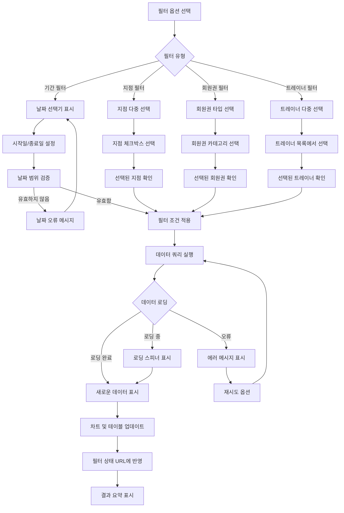
```mermaid
graph TD
    A[필터 옵션 선택] --> B{필터 유형}
    
    B -->|기간 필터| C[날짜 선택기 표시]
    B -->|지점 필터| D[지점 다중 선택]
    B -->|회원권 필터| E[회원권 타입 선택]
    B -->|트레이너 필터| F[트레이너 다중 선택]
    
    C --> G[시작일/종료일 설정]
    D --> H[지점 체크박스 선택]
    E --> I[회원권 카테고리 선택]
    F --> J[트레이너 목록에서 선택]
    
    G --> K[날짜 범위 검증]
    H --> L[선택된 지점 확인]
    I --> M[선택된 회원권 확인]
    J --> N[선택된 트레이너 확인]
    
    K -->|유효하지 않음| O[날짜 오류 메시지]
    O --> C
    
    K -->|유효함| P[필터 조건 적용]
    L --> P
    M --> P
    N --> P
    
    P --> Q[데이터 쿼리 실행]
    Q --> R{데이터 로딩}
    
    R -->|로딩 중| S[로딩 스피너 표시]
    R -->|로딩 완료| T[새로운 데이터 표시]
    R -->|오류| U[에러 메시지 표시]
    
    S --> T
    U --> V[재시도 옵션]
    V --> Q
    
    T --> W[차트 및 테이블 업데이트]
    W --> X[필터 상태 URL에 반영]
    X --> Y[결과 요약 표시]
```

### 상세 플로우 - 리포트 생성 및 공유
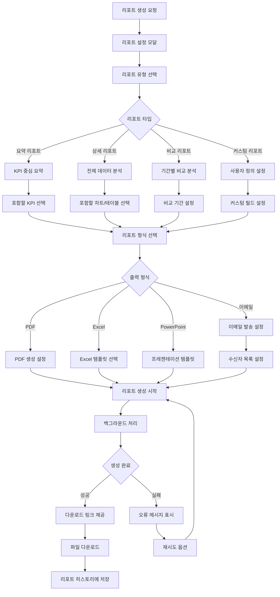
```mermaid
graph TD
    A[리포트 생성 요청] --> B[리포트 설정 모달]
    B --> C[리포트 유형 선택]
    
    C --> D{리포트 타입}
    D -->|요약 리포트| E[KPI 중심 요약]
    D -->|상세 리포트| F[전체 데이터 분석]
    D -->|비교 리포트| G[기간별 비교 분석]
    D -->|커스텀 리포트| H[사용자 정의 설정]
    
    E --> I[포함할 KPI 선택]
    F --> J[포함할 차트/테이블 선택]
    G --> K[비교 기간 설정]
    H --> L[커스텀 필드 설정]
    
    I --> M[리포트 형식 선택]
    J --> M
    K --> M
    L --> M
    
    M --> N{출력 형식}
    N -->|PDF| O[PDF 생성 설정]
    N -->|Excel| P[Excel 템플릿 선택]
    N -->|PowerPoint| Q[프레젠테이션 템플릿]
    N -->|이메일| R[이메일 발송 설정]
    
    O --> S[리포트 생성 시작]
    P --> S
    Q --> S
    R --> T[수신자 목록 설정]
    T --> S
    
    S --> U[백그라운드 처리]
    U --> V{생성 완료}
    
    V -->|성공| W[다운로드 링크 제공]
    V -->|실패| X[오류 메시지 표시]
    
    W --> Y[파일 다운로드]
    Y --> Z[리포트 히스토리에 저장]
    
    X --> AA[재시도 옵션]
    AA --> S
```

---

## 플로우 간 연결 및 통합

### 고객 라이프사이클 통합 플로우
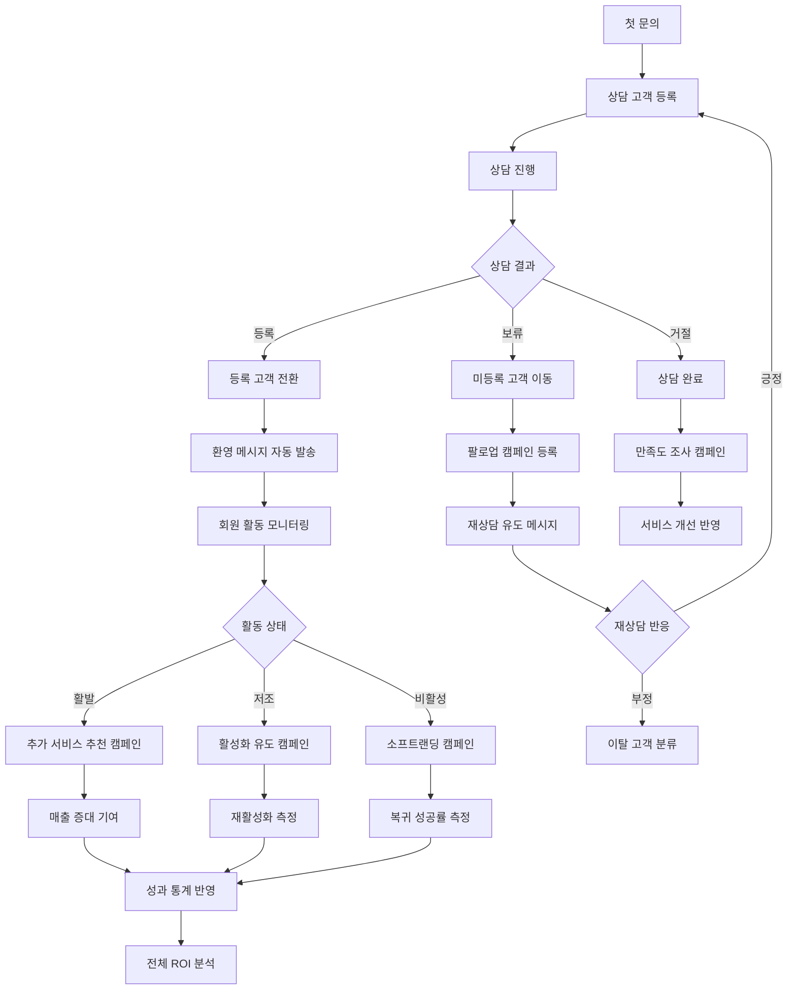
```mermaid
graph TD
    A[첫 문의] --> B[상담 고객 등록]
    B --> C[상담 진행]
    C --> D{상담 결과}
    
    D -->|등록| E[등록 고객 전환]
    D -->|보류| F[미등록 고객 이동]
    D -->|거절| G[상담 완료]
    
    E --> H[환영 메시지 자동 발송]
    F --> I[팔로업 캠페인 등록]
    G --> J[만족도 조사 캠페인]
    
    H --> K[회원 활동 모니터링]
    I --> L[재상담 유도 메시지]
    J --> M[서비스 개선 반영]
    
    K --> N{활동 상태}
    N -->|활발| O[추가 서비스 추천 캠페인]
    N -->|저조| P[활성화 유도 캠페인]
    N -->|비활성| Q[소프트랜딩 캠페인]
    
    L --> R{재상담 반응}
    R -->|긍정| B
    R -->|부정| S[이탈 고객 분류]
    
    O --> T[매출 증대 기여]
    P --> U[재활성화 측정]
    Q --> V[복귀 성공률 측정]
    
    T --> W[성과 통계 반영]
    U --> W
    V --> W
    
    W --> X[전체 ROI 분석]
```

### 크로스 플랫폼 데이터 흐름
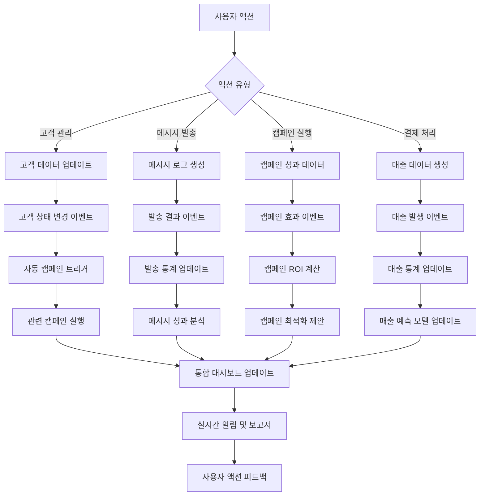
```mermaid
graph TD
    A[사용자 액션] --> B{액션 유형}
    
    B -->|고객 관리| C[고객 데이터 업데이트]
    B -->|메시지 발송| D[메시지 로그 생성]
    B -->|캠페인 실행| E[캠페인 성과 데이터]
    B -->|결제 처리| F[매출 데이터 생성]
    
    C --> G[고객 상태 변경 이벤트]
    D --> H[발송 결과 이벤트]
    E --> I[캠페인 효과 이벤트]
    F --> J[매출 발생 이벤트]
    
    G --> K[자동 캠페인 트리거]
    H --> L[발송 통계 업데이트]
    I --> M[캠페인 ROI 계산]
    J --> N[매출 통계 업데이트]
    
    K --> O[관련 캠페인 실행]
    L --> P[메시지 성과 분석]
    M --> Q[캠페인 최적화 제안]
    N --> R[매출 예측 모델 업데이트]
    
    O --> S[통합 대시보드 업데이트]
    P --> S
    Q --> S
    R --> S
    
    S --> T[실시간 알림 및 보고서]
    T --> U[사용자 액션 피드백]
```

---

## 예외 상황 및 에러 핸들링

### 공통 에러 처리 플로우
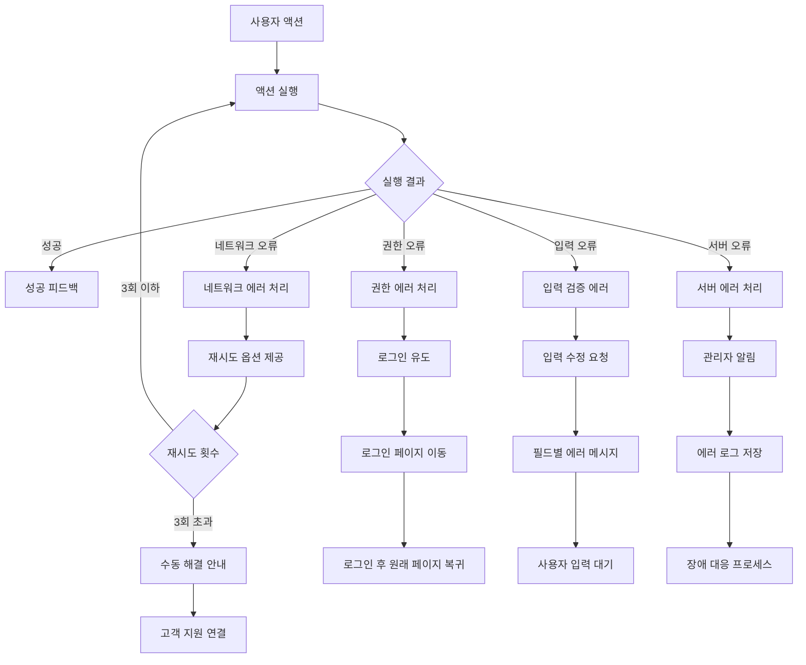
```mermaid
graph TD
    A[사용자 액션] --> B[액션 실행]
    B --> C{실행 결과}
    
    C -->|성공| D[성공 피드백]
    C -->|네트워크 오류| E[네트워크 에러 처리]
    C -->|권한 오류| F[권한 에러 처리]
    C -->|입력 오류| G[입력 검증 에러]
    C -->|서버 오류| H[서버 에러 처리]
    
    E --> I[재시도 옵션 제공]
    F --> J[로그인 유도]
    G --> K[입력 수정 요청]
    H --> L[관리자 알림]
    
    I --> M{재시도 횟수}
    M -->|3회 이하| B
    M -->|3회 초과| N[수동 해결 안내]
    
    J --> O[로그인 페이지 이동]
    K --> P[필드별 에러 메시지]
    L --> Q[에러 로그 저장]
    
    N --> R[고객 지원 연결]
    O --> S[로그인 후 원래 페이지 복귀]
    P --> T[사용자 입력 대기]
    Q --> U[장애 대응 프로세스]
```

---

**다음 단계**: 디자인 시스템 문서화 및 가이드라인 정의